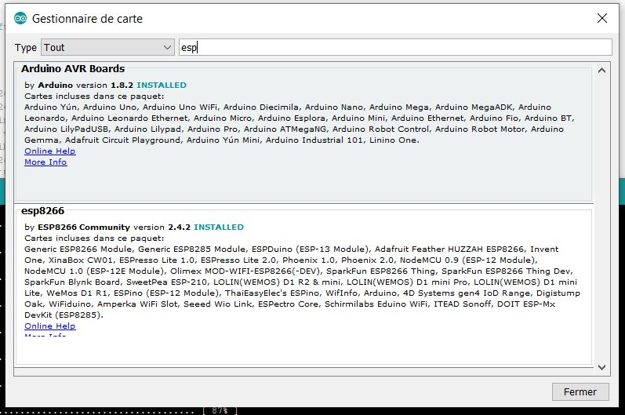

+++++++++++++++++++++++++++++++++++++++++++
IoT Electrical Power Strip Assembly manual
+++++++++++++++++++++++++++++++++++++++++++

:Auteur: J.Soranzo
:Date: December 2019
:Societe: VoLAB
:Entity: VoRoBoTics

.. contents::
    :backlinks: top

================================
Solder components onto the board
================================
Progressive assembly and test

To check the board fonctionnality, we need all I2C components:

- on the board:
  - ATtiny watch dog (programmed)
  - Nano I2C IO expander (programmed)

- out of the board
  - RTC
  - oled screen (not absolutly necessary for test but very usefull)

The 5V power supply

====================================================================================================
Program Attiny85 watchdog
====================================================================================================

- Outil => Arduino UNO
- Outil => Port COM 
- Fichier/exemples/11 ArduinoISP
- download ...
- File/open/ ... EasySlaves/TinyI2CWatchdog/TinyI2CWatchdog.ino
- Tools/ Attiny25/45/85
- Tools/ change ATtiny85
- Tools/ clock 8MHz
- Tools /Arduino as ISP
- Download.

`Link to add Atiny85 to Arduino IDE`_

.. _`Link to add Atiny85 to Arduino IDE` : https://raw.githubusercontent.com/damellis/attiny/ide-1.6.x-boards-manager/package_damellis_attiny_index.json

right clic anc copy/paste in Arduino preferences

Test it : com speed 1200

If ATtiny is wright programmed it shuld display  at powerup::

    boot
    RC1I1
    RC2I1
    RC3I1... every second

====================================================================================================
Prepare your credentials file
====================================================================================================
You need to create a  credential.json file in the directory data of the Arduino project.

as this::

    {
        "general": {
            "ssid" : "yourWifiSsid",
            "pass" : "yourWifiPass",
            "softApSsid" : "IoT_ESP_mcmc",
            "softApPass" : "123456789"
        }
    }

SoftAp parameters are for connections in AP mode.
SoftAp password need to have at least 8c

====================================================================================================
Program ESP8266 in stand alone
====================================================================================================

Use Arduino IDE (tested with IDE v1.8.9)

Install ESP8266 from:

https://arduino.esp8266.com/stable/package_esp8266com_index.json

Following lib should be installed: see :ref:`used liraries<usedLirary>`

You need also esptools to program SPIFFS

.. DANGER::
    ARDUINO IDE 1.8.12, ESP8266 2.4.7 doesn't work for me when i try to program SPIFFS.
	Error : esptool not found

    ESP8266 Arduino IDE conf 

Program ESP8266 data

Programm sktech

In serial monitor you should see
====================================================================================================
.. code::

    Volab CSystem::init > Sketch start...
    <Volab CSystem::init >  Build : May  5 2021 @ 21:34:05
    <Volab CSystem::init > File system correctly Open @ setup level
    <Volab CSystem::init > File check !
    <Volab CSystem::init > file : /index.html is present
    <Volab CSystem::init > file : /config4.json is present
    <Volab CSystem::init > file : /firstboot.html is present
    <Volab CSystem::init > file : /js/main.js is present
    <Volab CSystem::init > file : /js/plug.js is present
    <Volab CSystem::init > file : /js/regExPatern.js is present
    <Volab CSystem::init > file : /js/table.js is present
    <Volab CSystem::init > file : /css/sidebar.css is present
    <Volab CSystem::init > file : /css/style.css is present
    <Volab CSystem::init > Result all files are present ? OK
    <Volab reading config param. > Mounting FS...
    <Volab reading config param. > File system mounted 
    <Volab reading config param. > reading config file
        config file opened 
    <Volab reading config param. > Config file size : 1373
    <Volab CSystem::init > json mac add : 38:2B:78:04:AB:9F
    <Volab CSystem::init > Board Sation MAC add = 38:2B:78:04:AB:9F
    <Volab CSystem::init > Station equal add
    <Volab CSystem::init > json Soft AP mac add : 3A:2B:78:04:AB:9F
    <Volab CSystem::init > Board Soft AP MAC add = 3A:2B:78:04:AB:9F
    <Volab CSystem::init > AP equal add
    <Volab CSystem::init > I2C test start
    Write 0x10 to 1
    Write 0x12 to 2
    Read of reg 1 = ffffffff
    Read of reg 2 = ffffffff
    <Volab CSystem::init > i2cRecov number 1
    Starting I2C bus recovery
    Recovery ends with no known error
    Write 0x10 to 1
    Write 0x12 to 2
    Read of reg 1 = ffffffff
    Read of reg 2 = ffffffff
    <Volab CSystem::init > i2cRecov number 2
    Starting I2C bus recovery
    Recovery ends with no known error
    Write 0x10 to 1
    Write 0x12 to 2
    Read of reg 1 = ffffffff
    Read of reg 2 = ffffffff
    <Volab CSystem::init > i2cRecov number 3
    Starting I2C bus recovery
    Recovery ends with no known error
    Write 0x10 to 1
    Write 0x12 to 2
    Read of reg 1 = ffffffff
    Read of reg 2 = ffffffff
    <Volab CSystem::init > i2cRecov number 4
    Starting I2C bus recovery
    Recovery ends with no known error
    <Volab System error handler > Nano error
    <Volab CSystem::init > Nano test ok
    <Volab CSystem::init > Display oled Logo
    <Volab CSystem::init:Stratup Messages > OLED Logo pause
    <Volab CSystem::init:Stratup Messages > OLED startup message pause
    <Volab System error handler > DS3231 error
    <Volab CSystem::init > une remise a l'heure est necessaire
    <Volab CSystem::init > DS3231 Start date : 165/165/2165 165:165:85
    <Volab setUp > watchdog test 
    <Volab System error handler > watchdog error
    <Volab setUp > watchdog set to 30s.
    <Volab setUp > Main power state : ON
    <Volab setUp > number of plugs : 4
    <Volab write to jSon > redPlug : State = OFF
    <Volab reading config values for redPlug > Mode = Manuel
    <Volab reading config values for redPlug > Etat = OFF
    <Volab reading config values for redPlug > Start time = 
    <Volab reading config values for redPlug > End time = 
    <Volab reading config values for redPlug > on duration = 
    <Volab reading config values for redPlug > off duration = 
    <Volab reading config values for redPlug > Cloned plug = 
    <Volab reading config values for redPlug > Relay on off count = 70
    <Volab reading config values for redPlug > Jours : 
    <Volab write to jSon > greenPlug : State = OFF
    <Volab reading config values for greenPlug > Mode = Manuel
    <Volab reading config values for greenPlug > Etat = OFF
    <Volab reading config values for greenPlug > Start time = 
    <Volab reading config values for greenPlug > End time = 
    <Volab reading config values for greenPlug > on duration = 
    <Volab reading config values for greenPlug > off duration = 
    <Volab reading config values for greenPlug > Cloned plug = 
    <Volab reading config values for greenPlug > Relay on off count = 109
    <Volab reading config values for greenPlug > Jours : 
    <Volab write to jSon > bluePlug : State = OFF
    <Volab reading config values for bluePlug > Mode = Manuel
    <Volab reading config values for bluePlug > Etat = OFF
    <Volab reading config values for bluePlug > Start time = 
    <Volab reading config values for bluePlug > End time = 
    <Volab reading config values for bluePlug > on duration = 
    <Volab reading config values for bluePlug > off duration = 
    <Volab reading config values for bluePlug > Cloned plug = 
    <Volab reading config values for bluePlug > Relay on off count = 18
    <Volab reading config values for bluePlug > Jours : 
    <Volab write to jSon > yellowPlug : State = OFF
    <Volab reading config values for yellowPlug > Mode = Manuel
    <Volab reading config values for yellowPlug > Etat = OFF
    <Volab reading config values for yellowPlug > Start time = 
    <Volab reading config values for yellowPlug > End time = 
    <Volab reading config values for yellowPlug > on duration = 
    <Volab reading config values for yellowPlug > off duration = 
    <Volab reading config values for yellowPlug > Cloned plug = 
    <Volab reading config values for yellowPlug > Relay on off count = 9
    <Volab reading config values for yellowPlug > Jours : 
    <Volab setUp > Main power ON
    <Volab reading credentials > mounting FS...
    <Volab reading credentials > File system mounted
    <Volab reading credentials > Reading credit. file
        Credit. file is opened
    <Volab setUp, Wifilink begin > Wifi mode in json = Station
    <Volab setUp, Wifilink begin > try to set autoconnect to off
    <Volab setUp, Wifilink begin > Mode autoconnect read from ESP : enabled
    <Volab setUp, Wifilink begin > Wifi is connected ? No
    <Volab setUp, Wifilink begin > Wifi def mode in FLASH : 2
    <Volab setUp, Wifilink begin > Stored Wifi default soft AP param : 
    <Volab setUp, Wifilink begin >     SSID len : 10
    <Volab setUp, Wifilink begin >     Stored SSID :ESP_04AB9F.
    <Volab WiFi mode > WIFI_STA and AP
    <Volab setUp, Wifilink begin > Try softAccess
    <Volab setUp, Wifilink begin > Try soft AP with : powerStrip01_mac and plusDe8c
    <Volab setUp, Wifilink begin > softAP : Ready
    <Volab setUp, Wifilink begin > SoftAP returned IP address = 192.168.95.42
    <Volab setUp, Wifilink begin > Host name which does not work with Android is : PowerStrip01
    <Volab setUp, Wifilink begin > Try to join : Livebox-FX25689
    ...
    <Volab setUp, Wifilink begin > Number of Station wifi try : 3, max was : 30
    <Volab setUp, Wifilink begin > NTP enabled
    <Volab setUp, Wifilink begin > Adresse Wifi.localIP Station mode : 192.168.1.49
    <Volab write  param to jSon file > /config4.json
    <Volab write  param to jSon file >  general : staIP = 192.168.1.49
    <Volab setUp > NTP enable ? TRUE
    <Volab CSystem::timeServerCheck > check started
    <Volab CSystem::timeServerCheck > NTP Time : 5/5/2021 21:37:7
    <Volab CSystem::timeServerCheck > DS3231 set to NTP time due to power lost.
    <Volab write  param to jSon file > /config4.json
    <Volab write  param to jSon file >  general : ntpError = OFF
    Serial Command list :
    <h> ou <H> display this list
    <E> display status
    <C> Check DS3231 date
    <S JJ/MM/AAAA HH:MM:SS> returns code <O>
    <T HH:MM:SS> returns code <O>
    <s> set DS3231 by NTP server
    <J> for display config.json
    <W> display WIFI mode
    
 write config parameter in json WARNING
    <I _newSSID> write SSID in credentials WARNING
    <i _wifiPass> write password in credentials WARNING
    <t various_param> for code test
    <N> nano IO expander test
    <O> nano out test HIGH
    <o> nano out test low
    <F> Find I2C device I2C scan
    <R> I2C recovery
    <c> I2C crash
    <a> for Ip address
    <w> for WiFi.printDig function
    <z> display credetial file
    <L> _newSoftAP_SSID> write SoftAP SSID in credentials WARNING
    <l> _wifiPass> write soft AP password in credentials WARNING
    <D> SPIFFS dir
    <j> display general part of config json file
    <d _filename> erase a file WARNING
    <e> display system status
    
 display main power state
    <Volab setUp > Leds On config : -1
    <Volab setUp > Leds On lumi : 5
    <Volab setUp > [HTTP] begin...
    <Volab setUp > [HTTP] GET... http://www.google.fr/
    <Volab setUp > [HTTP] GET... code: 200
    <Volab setUp > Watchdog set to 10s with a refresh period to 5s
    <Volab setUp > Loop start
    <Volab in the loop > It is time to check necessary file accessibility !
    <Volab in the loop > It is time to check Internet health !
    <Volab in the loop > Check NTP access : OK
    <Volab in the loop > i2cRecov number 1
    Starting I2C bus recovery
    Recovery ends with no known error
    <Volab in the loop > i2cRecov number 2
    Starting I2C bus recovery
    Recovery ends with no known error
    <Volab in the loop > i2cRecov number 3
    Starting I2C bus recovery
    Recovery ends with no known error
    <Volab in the loop > i2cRecov number 4
    Starting I2C bus recovery
    Recovery ends with no known error
    <Volab System error handler > Nano error
    <Volab in the loop > It is time to check necessary file accessibility !
    <Volab in the loop > It is time to check Internet health !
    <Volab in the loop > Check NTP access : OK
    <Volab in the loop > i2cRecov number 1
    Starting I2C bus recovery
    Recovery ends with no known error
    <Volab in the loop > i2cRecov number 2
    Starting I2C bus recovery
    Recovery ends with no known error
    <Volab in the loop > i2cRecov number 3
    Starting I2C bus recovery
    Recovery ends with no known error
    <Volab in the loop > i2cRecov number 4
    Starting I2C bus recovery
    Recovery ends with no known error
    <Volab System error handler > Nano error

... A lots of errors : I2C, OLEDRTC clock, Nano IO Expander but WiFi work

====================================================================================================
Program Arduino nano
====================================================================================================
With nanoI2CIOExpander project

With ligne 19 in the file debugSerialPort.h uncommented Nano display debug info like this @9600 
serial speed::

    <Volab IOExpander setup : > NANO version : 2.1 : BUILD May  5 2021 22:39:15
    <Volab I2C ADD builder : > add pin number = 13
    <Volab I2C ADD builder : > D13 = LOW
    <Volab IOExpander setup : > I2C adresse : 58
    <Volab IOExpander setup : > registers[0] = 2
    <Volab IOExpander setup : > registers[1] = 0
    <Volab IOExpander setup : > registers[2] = 0
    <Volab IOExpander setup : > registers[3] = 55
    <Volab IOExpander setup : > registers[4] = 0
    <Volab IOExpander setup : > registers[5] = a5
    <Volab IOExpander setup : > registers[6] = 1
    <Volab IOExpander setup : > registers[7] = 0
    <Volab IOExpander setup : > registers[8] = 0
    <Volab IOExpander setup : > registers[9] = 0
    <Volab IOExpander setup : > registers[a] = 0
    <Volab IOExpander setup : > registers[b] = a5
    <Volab IOExpander setup : > registers[c] = a5
    <Volab IOExpander setup : > registers[d] = a5
    <Volab IOExpander setup : > registers[e] = a5
    <Volab IOExpander setup : > registers[f] = a5
    <Volab IOExpander setup : > registers[10] = a5
    <Volab IOExpander setup : > registers[11] = a5
    <Volab IOExpander setup : > registers[12] = a5
    <Volab IOExpander setup : > registers[13] = a5
    <Volab IOExpander setup : > registers[14] = a5
    <Volab IOExpander setup : > registers[15] = a5
    <Volab IOExpander setup : > registers[16] = a5
    <Volab IOExpander setup : > registers[17] = a5
    <Volab IOExpander setup : > registers[18] = ca
    <Volab IOExpander setup : > registers[19] = fe
    <Volab IOExpander setup : > registers[1a] = fe
    <Volab IOExpander setup : > registers[1b] = ca
    <Volab IOExpander setup : > registers[1c] = a5
    <Volab IOExpander setup : > registers[1d] = a5
    <Volab IOExpander setup : > registers[1e] = a5
    <Volab IOExpander setup : > registers[1f] = a5

But with this ligne commented it display nothing !

================================
Connect wires to the plugs
================================
Wire all parts like on this pictures

    Push button and color led wires 

    Push button and color led wires details 

====================================================================================================
Notes de mise au point du PCB (A SUPRIMER)
====================================================================================================
Alimentation ? Quid de l'alim 5V et de l'alimentation USB

Donc avec le PCB 2664013A_Y7

Par où on commence ? 

- Par souder les composants passifs
- On vérifie l'absence de CC

Relay 1 : référence ? SRD-05VDC-SL-C. Est-ce que j'en ai ? `Lien Banggood SRD-05`_

.. _`Lien Banggood SRD-05` :   https://www.banggood.com/fr/Mini-5V-DC-Power-Relay-SRD5VDCSLC-5-Pin-PCB-Type-p-930170.html?rmmds=detail-left-hotproducts__4&cur_warehouse=CN

Des `relais 30A ! chez Banggood:`_

.. _`relais 30A ! chez Banggood:` : https://www.banggood.com/fr/5Pcs-SLA-05V-12V-24VDC-SL-A-SL-C-5V-12V-24V-DC-30A-4Pin-Relay-Module-p-1555743.html?rmmds=detail-left-hotproducts__7&ID=519957&cur_warehouse=CN

Données de mise au point:

- ajouter une diode sur le 5V de l'ESP pour éviter que l'USB ne réalimente la carte?
- de la même manière l'USB du UNO pourrait réalimenter la carte, ajouter une diode pin 27
- Pour les LED rouge mettre les résistance dans la branche + pour avoir un GND commun (simplification cablage)
- prepare collor LED with wires before mounting
- on pcb group P3, P6, P4 and P7 2 points connectors in only one connector with only one GND pin (R1 and R2 in the positiv branch)
- place this connector on the other size of the PCB
- reduce width of the PCB about 5 to 10 mm
- group P8 and P9 but keep 2 gnd pin
- migrate PCB to CMS version (R0806, C0603, Q1 to Q3 and U3)
- move p2 to the right side of the pcb under H1 and move H1 and P1 to the upper of the PCB (keep them on right)
- change realy1 to MOSFET version 
- ajouter une résistance 0 ohm sur le 3V3 du nano non montée afin de pouvoir injecter du 3.3 depuis ce dernier.
- relay connector : only one wire per chanel (short chanels two by two on relay board on solder side)

Dernier point inutile en fonctionnement mais pratique pour la mise au point.

Mise au point en juin 2020
====================================================================================================
Changement de pc de développement. Probblème avec la branche dev_jojo détecté grâce à gitKraken

Creation de la nouvelle branche devFirmware.

Programmation de l'ESP, sans rien autour. 

Difficultées avec la version des outils ESP8266 pour programmer SPIFFS.

Mais après avoir programmé l'ESP8266, on ne peut pas vérifier correctement le fonctionnement car
on bloque rapidement sur un Erreur fatale et impossible de diagnostiquer à cause du sabordage.

Création d'un branche dédiée à cette mise au point branch : noSaborde

=========
Weblinks
=========

.. target-notes::
