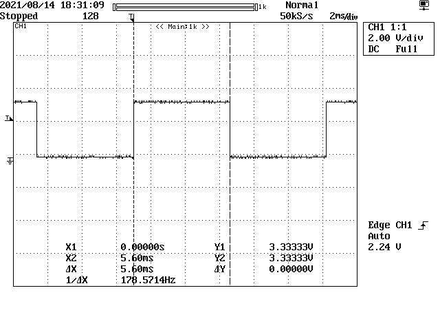
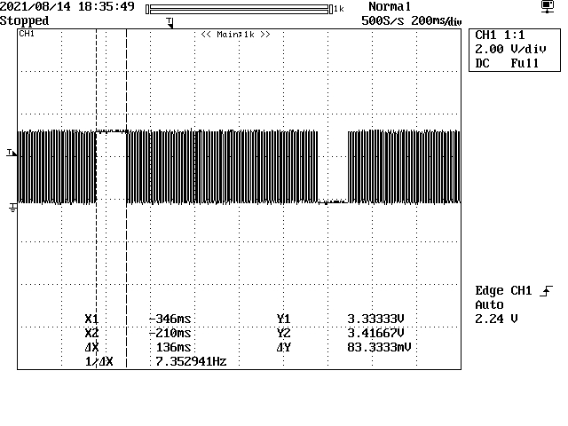

++++++++++++++++++++++++++++++++++++++++++++++++++++++++++++++++++++++++++++++++++++++++++++++++++++
IoTEps Chronogram
++++++++++++++++++++++++++++++++++++++++++++++++++++++++++++++++++++++++++++++++++++++++++++++++++++

:Auteur: J.Soranzo
:Date de création: 08/2021
:Last update: 08/2021
:Societe: VoRoBoTics
:Entity: VoLAB

.. contents::
    :backlinks: top

====================================================================================================
Oscilloscope readings: loop cycle study
====================================================================================================
This timing chronogram was made with a **special version of the firmaware** that use PB0(D6) of
the ESP8266 input redefined as output. 

Shortest loop cycle
====================================================================================================
  

    Shortest loop cycle

The shortest loop cycle in idle stade is 5.6ms

A strange cycle
====================================================================================================

    136ms cycle every 1s
    
Probably web server check. Plug is in idle state (nothing to do). No 1s period timer in our code.

Push button cycle
====================================================================================================

    Handle a plug psuh button 

This operation take 300ms.

Plug on/off handler duration
====================================================================================================

    Plug on/off handler take 53ms
    
and

    Plug on off without debug prints 

Without debug prints on serial it take only 33ms.

A complete web exchange
====================================================================================================

    Complete web exchange : 11.74s (very long)

That correspond to::

    <Volab handleIndex > Mode Station index page
    handleFileRead: /
    handleFileRead _path : /index.html (48ko)
    handleFileRead _path : /css/sidebar.css (2ko)
    handleFileRead _path : /css/style.css (4ko)
    handleFileRead _path : /js/myLog.js (1k)
    handleFileRead _path : /js/regExPatern.js (9k)
    handleFileRead _path : /js/plug.js (19k)
    handleFileRead _path : /js/main.js (14k)
    handleFileRead _path : /js/table.js (9k)
    handleFileRead _path : /img/green.png (28k)
    handleFileRead _path : /img/logo_alpha.png (83k)
    handleFileRead _path : /img/red.png (28k)
    handleFileRead _path : /img/blue.png (28k)
    handleFileRead _path : /img/yellow.png (30k)
    handleFileRead _path : /config4.json (1.7k)

Only the function handlehtmlReq (tag pin toggle move in the function)

    Juste time of the function 

    1.48s cyle

Probably the transfert of index.html

Handel html param in manual mode - example
====================================================================================================

    Web browser set one plug manual mode on or off
    
This operation take 443ms

====================================================================================================
Conclusions
====================================================================================================
Serial prints takes time !

The size of the files should be shorten (logo, green.png, yellow.png... javascript files)

