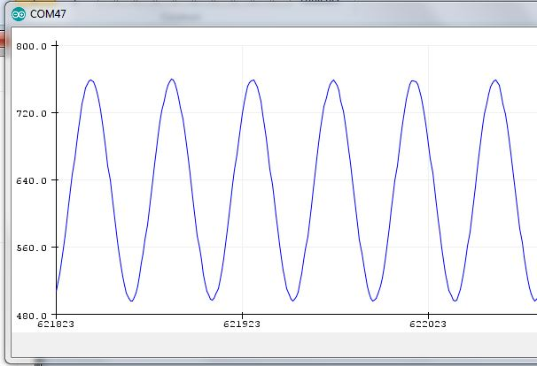

.. index::
    pair: Software; Curent sensing

++++++++++++++++++++++++++++++++
IOT EPS curent Sensing
++++++++++++++++++++++++++++++++

.. contents:: 
    :backlinks: top

For sensor choice see hardware documentation.

Curent Sensing aborted for now  :doc:`see hardware documentation  <hardDev>`

.. WARNING::
    Current sensing was aborted due to sensor choice

AC mesurement
----------------------------------------------------------------------------------------------------
`Module AC on AliExpress`_ with voltage lower transformer

Usage example on `Youtube chanel of SurtrTech`_

Fortunately, the guy made a site! `SurtrTech`_

`Librairie filtre pour les calculs RMS`_ on ARDUINO absolutly not documented !

No documentation for this library of `Jonathan Driscoll`_

But luckily among the 40 forks a user wrote a doc, `Edgar Bonet`_

It is more of a presentation than actual documentation.

.. _`Module AC on AliExpress` : https://fr.aliexpress.com/item/32816455579.html

.. _`Youtube chanel of SurtrTech` : https://www.youtube.com/watch?v=WVcY108AAAw

.. _`SurtrTech` : https://surtrtech.com/2019/01/21/easy-measure-of-ac-voltage-using-arduino-and-zmpt101b/

.. _`Librairie filtre pour les calculs RMS` : https://github.com/JonHub/Filters

.. _`Jonathan Driscoll` : https://github.com/JonHub

.. _`Edgar Bonet` : https://github.com/edgar-bonet

================================
Première mesure
================================

.. code:: cpp

    #define RSSPEED 115200

    void setup(){
        Serial.begin( RSSPEED );
        //Serial.println( "Sketch start...");
    }

    void loop(){
        Serial.println( analogRead(A0) );
    }

To check if all is right !

================================================================
Example of usage of the library filtre.h
================================================================

.. code:: cpp

    /* This code works with ACS712 current sensor, it permits the calculation of the signal TRMS
     * Visit www.surtrtech.com for more details
     */

    #include <Filters.h>                      //This library does a massive work check it's .cpp file

    #define ACS_Pin A0                        //Sensor data pin on A0 analog input

    float ACS_Value;                              //Here we keep the raw data valuess
    float testFrequency = 50;                    // test signal frequency (Hz)
    float windowLength = 40.0/testFrequency;     // how long to average the signal, for statistist

    float intercept = 0; // to be adjusted based on calibration testing
    float slope = 0.0752; // to be adjusted based on calibration testing
                          //Please check the ACS712 Tutorial video by SurtrTech to see how to get them because it depends on your sensor, or look below

    float Amps_TRMS; // estimated actual current in amps

    unsigned long printPeriod = 1000; // in milliseconds
    // Track time in milliseconds since last reading 
    unsigned long previousMillis = 0;

    void setup() {
      Serial.begin( 9600 );    // Start the serial port
      pinMode(ACS_Pin,INPUT);  //Define the pin mode
    }

    void loop() {
      RunningStatistics inputStats;                 // create statistics to look at the raw test signal
      inputStats.setWindowSecs( windowLength );     //Set the window length
       
      while( true ) {   
        ACS_Value = analogRead(ACS_Pin);  // read the analog in value:
        inputStats.input(ACS_Value);  // log to Stats function
            
        if((unsigned long)(millis() - previousMillis) >= printPeriod) { //every second we do the calculation
          previousMillis = millis();   // update time
          
          Amps_TRMS = intercept + slope * inputStats.sigma();

          Serial.print( "\t Amps: " ); 
          Serial.print( Amps_TRMS );

        }
      }
    }

    /* About the slope and intercept
     * First you need to know that all the TRMS calucations are done by functions from the library, it's the "inputStats.sigma()" value
     * At first you can display that "inputStats.sigma()" as your TRMS value, then try to measure using it when the input is 0.00A
     * If the measured value is 0 like I got you can keep the intercept as 0, otherwise you'll need to add or substract to make that value equal to 0
     * In other words " remove the offset"
     * Then turn on the power to a known value, for example use a bulb or a led that ou know its power and you already know your voltage, so a little math you'll get the theoritical amps
     * you divide that theory value by the measured value and here you got the slope, now place them or modify them
     */

End

================================
How it is possible ?
================================

On Wikipedia, we learn that the standard deviation (sigma) is equivalent to RMS value. And filter
library has an statisitc modul that provide sigma !

See `Root mean square definition on Wikipedia`_

.. _`Root mean square definition on Wikipedia` : https://en.wikipedia.org/wiki/Root_mean_square

====================================================================================================
Possible components
====================================================================================================

================================
Weblinks
================================

.. target-notes::
