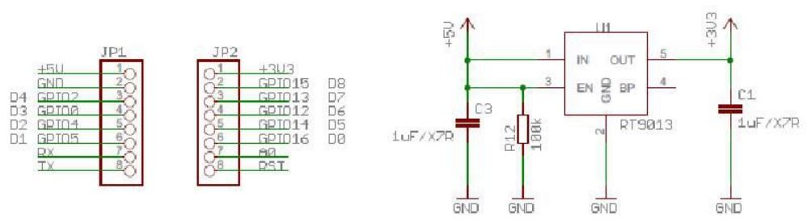

++++++++++++++++++++++++++++++++++++++++++++++
Document de conception hardware de IOT_ESP
++++++++++++++++++++++++++++++++++++++++++++++

:Auteur: J.Soranzo
:Date: Octobre 2018
:version: 1

.. contents:: Table of Contents
.. section-numbering::

.. include:: ../../README.rst
   :encoding: UTF-8

============
Avancement
============
#. alimentation ESP/Wemos en 5V ? : ok
#. choix curent sensor: 75%
#. horloge temps réelle : ok
#. bouton poussoirs : ok
#. Affectation des io : 90%
#. module relais : ok
#. définition des modes de fonctionnement : ok
#. récup paramètre via form submit html : ok
#. add  WS2801 LED : ok
#. Alimentation du module relais en 5V (choix du conver.) : 60%
#. add power led
#. add power button : 80% 
#. add wifi led : ok
#. add LDR
#. add I2C nano expander with analog inputs ok
#. packaging study
#. integartion
#. add a MOSFET on general power relay to switch them all in one time on power off

####

============================
AC power plug in the world 
============================

It's incredible !

See in `wikipedia power plug`_

and in French : `prise secteur sur wikipedia`_

.. _`wikipedia power plug` : https://en.wikipedia.org/wiki/AC_power_plugs_and_sockets

.. _`prises secteur sur wikipedia` : https://fr.wikipedia.org/wiki/Prise_%C3%A9lectrique#Plusieurs_normes_diff%C3%A9rentes

####

==================   
Alimentation ESP
==================
Premier écueil: l'ESP peut-il s'alimenter en 5V ?

Réponse : oui

    
    Circuit d'alimentation WEMOS D1 mini

####

====================
Horloge temps réelle
====================

Ajout d'un DS3231 comme dans le projet  `ESP_NTP_DS3231 <https://github.com/volab/ESP_NTP_DS3231>`_

.. important::

  D1 : SCL
  D2 : SDA
  
I2C pullup ? Visiblement sur le DS3231, il y en a !

####

====================
Choix current sensor
====================

INA219 et INA220
================
- impossible "bus voltage 0-26V"

ACS712
======

- "Output voltage proportional to AC or DC currents"

- "2.1 kVRMS minimum isolation voltage from pins 1-4 to pins 5-8"

- "5V power supply"

pb c'est pas de l'I2C et en plus x4

ACS764
======
Je n'arrive pas à voir la tension de rail max

- I2C
- courant max programmable
- Unidirectional DC current sensing and reporting : KO

Recherche internet
==================

"AC isolated current sensor I2C"

le vainqueur est `Si8901B-GS`_

.. _`Si8901B-GS` : https://www.silabs.com/products/isolation/current-sensors/si890x-isolated-adc-ac-mains-monitor

dispo chez `Mouser`_ à 3.44€/10pcs

.. _`Mouser` : https://www.mouser.fr/Search/Refine.aspx?Keyword=SI8901 

`Un exemple de mise en oeuvre`_

.. _`Un exemple de mise en oeuvre` : http://tinkerman.cat/the-espurna-board-a-smart-wall-switch-with-power-monitoring/#lightbox-gallery-oY6vOUw7/3/

Exemple open source

####

=======================
Choix du module relais
=======================

Coupure des 2 voies en même temps (phase et neutre) donc soit des relais 2 voies soit 8 relais.

Nous avons retenu l'option 8 relais car plus disponible dans l'écosphére ARDUINO.

The real need is a DPST relay but its very difficlut to find more with a 5V cmd and not with 
a breakout board form. A possible solution would be to make our own relays pcb.

Disponible entre autres chez `Banggood 8 Channel Module Module Relais`_ 

.. _`Banggood 8 Channel Module Module Relais` : https://www.banggood.com/fr/5Pcs-5V-8-Channel-Relay-Module-Board-For-Arduino-PIC-AVR-DSP-ARM-p-968931.html?rmmds=detail-left-hotproducts__2&cur_warehouse=CN

.. figure:: image/moduleRelais8Chan.jpg
    :align: center
    
    Photo module relais 8 voies de chez Banggod
    
Le gros soucis avec ces modules c'est que les relais sont actif par défaut.

On pourrait utiliser le contact repos, mais il y a un petit risque d'avoir une micro alimentation
des équipements derrière la prise pendant quelques milisecondes.

Solution : inversé le signal de commande avec 4 2N7000 à 0.24€ chez RS particulier

la bobine est données pour 70ohm sous 5V soit I environ 75mA * 8 = 571mA

Nous avons mesuré 156mA pour 2 relais ce qui donnerais 624mA pour les 8 soit un convertisseur 
AC/DC capable de délivrer 3.2W
    
####

=====================
Affectation des io
=====================

.. figure:: image/wemos-d1-mini-pinout_avecI2C.png
    :width: 600 px
    :align: center
    
    Wemos D1 Mini pinout

.. table:: Affectation des broches
    :align: center
    
    ===== =============
    pins  affectation
    ===== =============
    D0    WIFI LED
    D1    I2C SCL
    D2    I2C data
    D3    BP3
    D4    BP2
    D5    BP1
    D6    BP0
    D7    DATA WS2801
    D8    CLK WS2801
    ===== =============

On va pas aller loin avec ça !

Nécessite l'utilisation d'un IO expander

MCP23017 I2C 16 bits IO expander obsolete in feb 2019 see nanI2CIOexpander

.. figure:: image/mpc2307_pinout.jpg
    :width: 400 px
    :align: center
    
    MPC23017 pinout

.. table:: Affectation des broches sur le MCP23017 obsolete
    :align: center
    
    ===== =============
    pins  affectation
    ===== =============
    GPA0  PLUG0-ROUGE
    GPA1  PLUG1-VERT
    GPA2  PLUG2-BLEUE
    GPA3  PLUG3-JAUNE
    GPA4  LED0
    GPA5  LED1
    GPA6  LED2
    GPA7  LED3
    GBP0  MAIN POWER SWITCH STATE
    GPB1  
    GPB2  
    GPB3  
    ===== =============

Pour la mesure de courant ce serait bien de disposer de 4 entrée analogiques

L'ESP n'en possède qu'une !

===========================
nanoI2CIOExpander
===========================
To solve digital I/O and analog I decide to use a ARDUINO nano as I2C slave. I belived that someone
like ADAFRUIT or SPARFUN has build a lib to use an ARDUINO Nano as `I2C I/O expander`_.

That's my great surprise, nobody does it ! So I wrote it and I provide it on HACKSTER IO

.. _`I2C I/O expander` : https://www.hackster.io/MajorLeeDuVoLAB/nano-i2c-io-expander-3e76fc

Nano pining :

.. table:: Affectation des broches sur le MCP23017 obsolete
    :align: center
    
    ===== =============,    pins  affectation
    ===== =============
    D2    PLUG0-ROUGE
    D3    PLUG1-VERT
    D4    PLUG2-BLEUE
    D5    PLUG3-JAUNE
    D6    LED0
    D7    LED1
    D8    LED2
    D9    LED3
    D10   MAIN POWER SWITCH STATE
    D11   DS3231 power
    D12  
    A0    PLUG0 Current
    A1    PLUG1 Current
    A2    PLUG2 Current
    A3    PLUG3 Current
    A6    LDR
    A7
    ===== =============

    
####

=====================
BOM
=====================

- Carte 8 relais banggood 4.57
- 4 BP 0.2€ = 0.8€
- 1 ESP8266 WEMOD D1 mini : 2.81€
- 1 NANO V3 2.28€
- 4 Prises 1.9€ = 7.6€
- morceau de goulotte

Sous Total = 18.06€

- 4 mesure de courant 7.27€ = 29.08€

Total = 47.14

- 4 ACS712 isolated 3.99€ `sur aliexpresse`_

.. _`sur aliexpresse` : https://fr.aliexpress.com/item/ACS714-5A-20A-30A-5-v-Isoler-Capteur-De-Courant-Carte-de-D-rivation-Filtre-R/32865669250.html

- Autre ACS712 mieux isolé `toujours sur aliexpress`_ par 10pcs 2.62€/pcs fdp compris soit 4x2.62 = 10.48

.. _`toujours sur aliexpress` : https://fr.aliexpress.com/item/20A-Range-ACS712-Current-Sensor-Module-AC-Current-Sensor-DC-Hall-Current-Sensor-module-for-Arduino/32649182582.html?spm=a2g0w.search0204.3.84.73c22411wAFPs5&ws_ab_test=searchweb0_0,searchweb201602_5_10065_10068_319_5735015_10892_317_5734915_10696_10924_453_10084_454_10083_10618_10920_10921_10304_10922_10307_10820_10821_537_10302_536_5730115_10843_10059_10884_10887_100031_5735215_321_322_10103_5729115_5735115_10930,searchweb201603_51,ppcSwitch_0_ppcChannel&algo_expid=5ef8197b-2bdc-48f7-8a9b-d8edf6a406b9-11&algo_pvid=5ef8197b-2bdc-48f7-8a9b-d8edf6a406b9

 ce qui nous amènerait à 28.54€
 
- +4 led rouge d3mm
- +1 current fault
- +5 résistance 330ohm
- +4 LED neopixel `diam 8mm sur aliexpress`_ 4x0.23€
- +1 HLK-PM01 AC/DC 220V/5V 3.03€
- Fuse et porte fuse
- DS3231 avec batterie
- 4 x `2N7000 chez RS PArticulers`_

.. _`2N7000 chez RS PArticulers` : https://www.rs-particuliers.com/Search.aspx?Terms=671-4733&Page=0

.. _`diam 8mm sur aliexpress` : https://fr.aliexpress.com/item/20pcs-14mm-8mm-F8-DC5V-WS2801-2801-IC-diffused-RGB-LED-for-Pixel-LED-Module-Light/1966017933.html#!

5V power supply

https://www.banggood.com/5pcs-AC-DC-5V-2A-10W-Switching-Power-Bare-Board-Stabilivolt-Power-Module-AC-100-240V-To-DC-5V-p-1190175.html?rmmds=detail-left-hotproducts__3&cur_warehouse=CN

5pcs 6.03€

https://www.banggood.com/AC-DC-5V-2A-Switching-Power-Supply-Board-Low-Ripple-Power-Supply-Board-10W-Switching-Module-p-1337342.html?rmmds=search&cur_warehouse=CN

3€26 /pcs

====================
Useful Documentation
====================

Exemples 

=============
Weblinks
=============

.. target-notes::