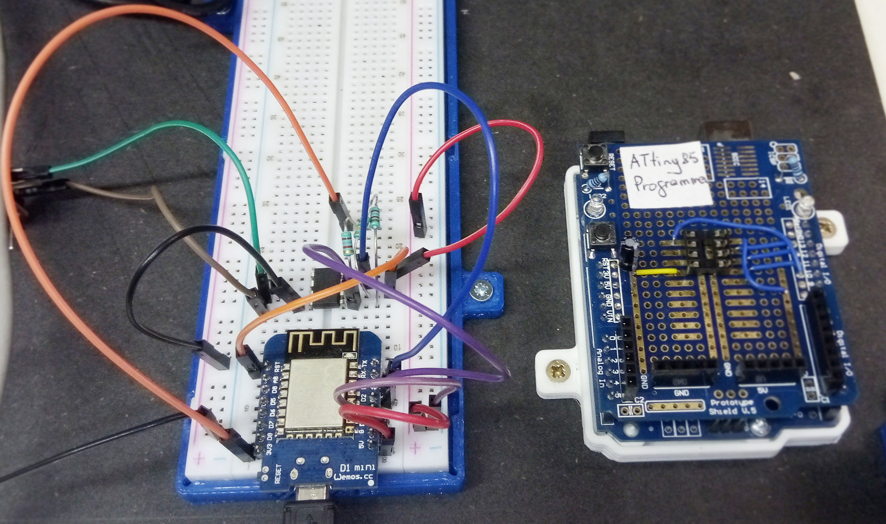
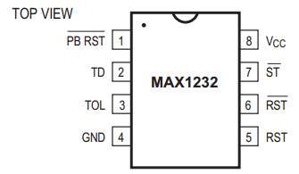
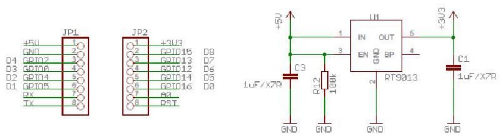
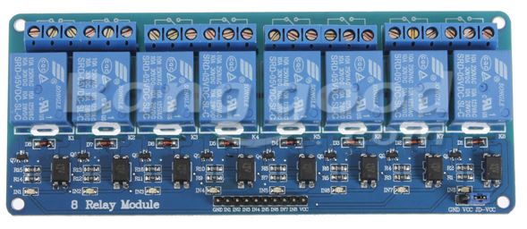

++++++++++++++++++++++++++++++++++++++++++++++
Document de conception hardware de IOT_ESP
++++++++++++++++++++++++++++++++++++++++++++++

:Auteur: J.Soranzo
:Date: Octobre 2018
:version: git versionning

.. contents:: Table of Contents
.. section-numbering::

.. include:: ../../README.rst
   :encoding: UTF-8

============
Avancement
============
#. alimentation ESP/Wemos en 5V ? : ok
#. horloge temps réelle : ok
#. bouton poussoirs : ok
#. Affectation des io : ok
#. module relais : ok
#. définition des modes de fonctionnement : ok
#. récup paramètre via form submit html : ok
#. add  WS2801 LED : ok
#. Alimentation du module relais en 5V (choix du conver.) : 60%
#. add power led ok
#. add power button : ok 
#. add wifi led : ok
#. add LDR : removed
#. add I2C nano expander with analog inputs ok

#. change BP to nano I2C and relay command to ESP directly (to allow turnoff relays in fatal error) ok
#. resolv power up problem : implement MAX1232 [ as an option onto the PCB ]
#. implement an I2C watch dog component [ as an option onto the PCB ]
#. choix curent sensor: 75%
#. pcb study
#. packaging study
#. integartion
#. add a MOSFET on general power relay to switch them all in one time on power off

####

====================
Watchdog function
====================
During multiple tests, i noticed that watch dog functionnality of the ESP8266 may fail to reset 
the component. But perhaps only when connected to usb port. **So i must made more tests.**

What are others solutions for watchdog

RTC DS3231 has a INT output but we can only set to 1 / second or 1/minutes. And it is a pour
solution to control this component to use itself !

MAX1232 has a watch dog feature but with a maximum of 1.2s and direct at startup activated.
It can't be activate after setup for example. And if we use it, we need to drive its ST pin
but all our output are used !

Use a I2C watchdog component as DS1371. If using this component we need to implement
a 32kHz oscillator ! `DS1374U-3+`_ (power sup 3V) ou -33+ en 3.3V available on MOUSER site for 3€23
Don't forget to buy oscillator : `32k quatz chez Mouser`_ 0.68€ !

Warning U denote a uSOP package with à 0.5mm pitch!

Perhaps DS1374 could replace MAX1232 but its VPF level is very low about 2.3V regardless of the
4.6V of the MAX1232.

`Arduino library for DS1374 here`_

Use the NANOI2CIOExpander it is not implented on the library (perhaps a future function).

a DS1307 or 1302 similar to DS3231 SQW/out only 1Hz

.. _`DS1374U-3+` : https://www.mouser.fr/ProductDetail/Maxim-Integrated/DS1374U-33%2b?qs=sGAEpiMZZMtpeOq%2F1QMb1SSF%252Bt1WeK6PeIGzk2pj%252BtA%3D
.. _`32k quatz chez Mouser` : https://www.mouser.fr/ProductDetail/Citizen-FineDevice/CFV-20632000AZFB?qs=byeeYqUIh0OaNx0Ju8%2FDbw==&vip=1&gclid=Cj0KCQjwyLDpBRCxARIsAEENsrJb6yYHxWLeDO4R19WO-TyqA6z7VGyO8gui8RFReQgJSRtIWyGPwV0aAsVlEALw_wcB
.. _`Arduino library for DS1374 here` : https://github.com/SpellFoundry/DS1374RTC

An other idea : use an Attiny85 as an I2C watch dog component. It already exists ! `ATTiny85 I2C watchdog experiment`_

.. _`ATTiny85 I2C watchdog experiment` : https://github.com/letscontrolit/ESPEasySlaves

ATtiny85 watchdog
=====================
After some tests, I decided to use it.

I build a ATtiny programmer with a ARDUINO UNO and a `proto shield`_ from Banggood

A little watching on the `Heliox' Youtube video`_ and it was enough to start !

So i decided for this time to stop  MAX1232 integration.

The only chnages that i made in the code of the ATtiny85 watchdog are :
 - Settings.TimeOut          = 20;
 - Settings.Sleep            = 20;

 An other change : I was obliged to move files in TinyWireS_Custom directory to one upper level !
 
This design works perfectly ! but what is the user license of this code ? Perhaps GNU Public 2.1

    
    ATtiny85 I2C watchdog hardware test environment

The only missing in this design is an ESP user library. So I write it !    

Power ATtiny with 3.3V and don't forget pullup on D3 and on reset (15k)

.. _`proto shield` : https://www.banggood.com/Arduino-Compatible-328-ProtoShield-Prototype-Expansion-Board-p-926451.html?rmmds=search&cur_warehouse=CN
.. _`Heliox' Youtube video` : https://www.youtube.com/watch?v=S-oBujsoe-Q&t=247s

======================
MAX1232 integration
======================

    
    MAX1232 pinout
    
    
Very simple : connect VCC, GND and RST/ to RST pin of the 8266 !

Add a pullup on RST/. Also pullup TOL pin 3 (tolerance 10%), pin 7 WD input and pin 1 PBRST/

Warning MAW1232 check power supply in 5V+/-5% ie 4.75 to 5.25V

==================================
Connect Relay direct to ESP
==================================
Today relays are connected to nano and Push Button are directly connected to ESP8266.
The purpose is to connect relays to ESP8266 and push button to nano.
Cause when there is an error on I2C bus relay commands are no accessibles and we can't switch 
it off with main power switch.

List of change:
 - IoT_EPS.h Pinning
 - void bouton::begin( int boutonPin ) : pinMode(boutonPin, INPUT_PULLUP); _nano.pinMode
 - void bouton::update() : large changes digitalRead to _nano.digitalRead (group in one line)
 - bool bouton::directRead() => one _nano.digitalRead.
 - void CPowerPlug::begin : one line     _nano.pinMode( _pin, OUTPUT ); to normal pinMode 
 - void CPowerPlug::updateOutputs : one line to change
 
A failure (work branch : relayChange) because ESP8266 pin are others usages that are not compatibles
with relay command. Specaly D3 and D4 respectively IO-0 and IO-2 that are used during the reset 
and that changes state. So we leave this work on its branche and return to the previous
configuration with relay commands connected to the NanoI2CIOExpander.

Others solutions to solve our problem:

#. use a WEmos ESP32 with more IO (perhaps we can remove NanoI2CIOExpander...)
#. use another relay or a transitor MOS to switch off the 5V Power supply of the relay commands.
   This new relay would be drive directly by the Main Power Switch

Problem solved with the second solution.

============================
AC power plug in the world 
============================

It's incredible !

See in `wikipedia power plug`_

and in French : `prises secteur sur wikipedia`_

.. _`wikipedia power plug` : https://en.wikipedia.org/wiki/AC_power_plugs_and_sockets

.. _`prises secteur sur wikipedia` : https://fr.wikipedia.org/wiki/Prise_%C3%A9lectrique#Plusieurs_normes_diff%C3%A9rentes

####

==================   
ESP power 
==================
First question: can we power ESP8266 with 5V external power  ?

Answer : yes

    
    Power schematic of WEMOS D1 mini

####

================================
ESP8266 power up problem
================================
When I power Wemos by external 5V, the system don't start correctly.

Apparently it stay locked in an unknow state for about 6 seconds and finaly it start.

I suspect a watch dog time out.

I try to put à 47uF on reset. With oscilloscope I watch the signal and I thinks that the slew rate
is to low.

I consider to add a MAX1232 on the reset pin or an analog circuit.

I checked IO0 (D3) used to flash the component is connect to BP3

At the begin of the setup I add a delay during this delay i drive the built-in LED for 1s 
and it solves the problem ! Very strange behavior !

==========================
Real time calendar clock
==========================

Add of a DS3231 as in the project : `ESP_NTP_DS3231 <https://github.com/volab/ESP_NTP_DS3231>`_

.. important::

  D1 : SCL
  D2 : SDA
  
I2C pullup ? There is pull up on DS3231 ! Yes I checked it 4.7k

Power consumption : 1.9mA measured 08/03/19

####

=======================
Current sensor choice
=======================

INA219 et INA220
=================

- impossible "bus voltage 0-26V"

ACS712
======

- "Output voltage proportional to AC or DC currents"

- "2.1 kVRMS minimum isolation voltage from pins 1-4 to pins 5-8"

- "5V power supply"

pb it is not I2C compnent and more we need 4

3 version exist -05 -20 -30 for 5A, 20A, 30A.

On Banggod there are :
  - `Banggood ACS712 5A version`_
  - `Banggood ACS712 30A version`_
  - `20A version on AliExpress`_
  
  20A version output a 100mV/A

.. _`Banggood ACS712 5A version`: https://www.banggood.com/ACS712TELC-05B-5A-Module-Current-Sensor-Module-For-Arduino-p-74020.html?akmClientCountry=FR&&cur_warehouse=CN
.. _`Banggood ACS712 30A version` : https://www.banggood.com/1PC-30A-New-Range-Current-Sensor-Module-for-ACS712-p-86583.html?rmmds=search&cur_warehouse=CN
.. _`20A version on AliExpress` : https://fr.aliexpress.com/item/32315336227.html

ACS764
======
I can't find rail to rail max  voltage

- I2C
- max courant  programmable
- but Unidirectional DC current sensing and reporting : KO

Internet search
==================

"AC isolated current sensor I2C"

The winer (not in 2019 !) is `Si8901B-GS`_

.. _`Si8901B-GS` : https://www.silabs.com/products/isolation/current-sensors/si890x-isolated-adc-ac-mains-monitor

dispo on `Mouser`_ à 3.44€/10pcs

But it requires a 3.3V power supply referenced to Neutral line ! (see fig16 page 24 og its datasheet)

.. _`Mouser` : https://www.mouser.fr/Search/Refine.aspx?Keyword=SI8901 

`Usage example`_ of an HLW8012. Open source example

.. _`Usage example` : http://tinkerman.cat/the-espurna-board-a-smart-wall-switch-with-power-monitoring/#lightbox-gallery-oY6vOUw7/3/

Finaly, now that we have on board NANOI2CIOExpander that provide 6 analog inputs we can use ACS712.

####

=======================
Choix du module relais
=======================

Coupure des 2 voies en même temps (phase et neutre) donc soit des relais 2 voies soit 8 relais.

Nous avons retenu l'option 8 relais car plus disponible dans l'écosphére ARDUINO.

The real need is a DPST relay but its very difficlut to find more with a 5V cmd and not with 
a breakout board form. A possible solution would be to make our own relays pcb.

Disponible entre autres chez `Banggood 8 Channel Module Module Relais`_ 

.. _`Banggood 8 Channel Module Module Relais` : https://www.banggood.com/fr/5Pcs-5V-8-Channel-Relay-Module-Board-For-Arduino-PIC-AVR-DSP-ARM-p-968931.html?rmmds=detail-left-hotproducts__2&cur_warehouse=CN

    
    Photo module relais 8 voies de chez Banggod
    
Le gros soucis avec ces modules c'est que les relais sont actif par défaut.

On pourrait utiliser le contact repos, mais il y a un petit risque d'avoir une micro alimentation
des équipements derrière la prise pendant quelques milisecondes.

Solution : inversé le signal de commande avec 4 2N7000 à 0.24€ chez RS particulier

la bobine est données pour 70ohm sous 5V soit I environ 75mA * 8 = 571mA

Nous avons mesuré 156mA pour 2 relais ce qui donnerais 624mA pour les 8 soit un convertisseur 
AC/DC capable de délivrer 3.2W
    
####

=====================
Affectation des io
=====================

.. figure:: image/wemos-d1-mini-pinout_avecI2C.png
    :width: 600 px
    :align: center
    
    Wemos D1 Mini pinout

.. table:: Affectation des broches
    :align: center
    
    ===== =============  =====================
    pins  affectation    ESP-GPIO
    ===== =============  =====================
    D0    Main Power sw  IO16
    D1    I2C SCL        IO5
    D2    I2C data       IO4
    D3    BP3            IO0 - Warning PU10k
    D4    BP2            IO2 - PU10k
    D5    BP1            IO14
    D6    BP0            IO12
    D7    DATA WS2801    IO13           
    D8    CLK WS2801     IO15 - PD10k    
    ===== =============  =====================

===========================
nanoI2CIOExpander
===========================
To solve digital I/O and analog I decide to use a ARDUINO nano as I2C slave. I belived that someone
like ADAFRUIT or SPARFUN has build a lib to use an ARDUINO Nano as `I2C I/O expander`_.

That's my great surprise, nobody does it ! So I wrote it and I provide it on HACKSTER IO

.. _`I2C I/O expander` : https://www.hackster.io/MajorLeeDuVoLAB/nano-i2c-io-expander-3e76fc

Nano pining :

.. table:: Affectation des broches sur l'ARDUINO Nano I2C I/O Expander
    :align: center
    
    ===== ======= =============
    pins   Name    affectation
    ===== ======= =============
    D2       0     PLUG0-ROUGE
    D3       1     PLUG1-VERT
    D4       2     PLUG2-BLEUE
    D5             PLUG3-JAUNE
    D6             LED0
    D7             LED1
    D8             LED2
    D9       7     LED3
    D10      8     WIFI LED 
    D11      9     MAIN POWER LED
    D12      10    Special BP
    A0            PLUG0 Current
    A1            PLUG1 Current
    A2             PLUG2 Current
    A3             PLUG3 Current
    A6    
    A7
    ===== ======= =============

    

    
####

=====================
BOM
=====================

- Carte 8 relais banggood 4.57
- 4 BP 0.2€ = 0.8€
- 1 ESP8266 WEMOD D1 mini : 2.81€
- 1 NANO V3 2.28€
- 4 Prises 1.9€ = 7.6€
- morceau de goulotte

Sous Total = 18.06€

- 4 mesure de courant 7.27€ = 29.08€

Total = 47.14

- 4 ACS712 isolated 3.99€ `sur aliexpresse`_

.. _`sur aliexpresse` : https://fr.aliexpress.com/item/ACS714-5A-20A-30A-5-v-Isoler-Capteur-De-Courant-Carte-de-D-rivation-Filtre-R/32865669250.html

- Autre ACS712 mieux isolé `toujours sur aliexpress`_ par 10pcs 2.62€/pcs fdp compris soit 4x2.62 = 10.48

.. _`toujours sur aliexpress` : https://fr.aliexpress.com/item/20A-Range-ACS712-Current-Sensor-Module-AC-Current-Sensor-DC-Hall-Current-Sensor-module-for-Arduino/32649182582.html?spm=a2g0w.search0204.3.84.73c22411wAFPs5&ws_ab_test=searchweb0_0,searchweb201602_5_10065_10068_319_5735015_10892_317_5734915_10696_10924_453_10084_454_10083_10618_10920_10921_10304_10922_10307_10820_10821_537_10302_536_5730115_10843_10059_10884_10887_100031_5735215_321_322_10103_5729115_5735115_10930,searchweb201603_51,ppcSwitch_0_ppcChannel&algo_expid=5ef8197b-2bdc-48f7-8a9b-d8edf6a406b9-11&algo_pvid=5ef8197b-2bdc-48f7-8a9b-d8edf6a406b9

 ce qui nous amènerait à 28.54€
 
- +4 led rouge d3mm
- +1 current fault
- +5 résistance 330ohm
- +4 LED neopixel `diam 8mm sur aliexpress`_ 4x0.23€
- +1 HLK-PM01 AC/DC 220V/5V seulement 3W soit 0.6A 3.03€ (un peu juste voir § `Choix du module relais`_ )
- Fuse et porte fuse
- DS3231 avec batterie
- 4 x `2N7000 chez RS PArticulers`_

.. _`2N7000 chez RS PArticulers` : https://www.rs-particuliers.com/Search.aspx?Terms=671-4733&Page=0

.. _`diam 8mm sur aliexpress` : https://fr.aliexpress.com/item/20pcs-14mm-8mm-F8-DC5V-WS2801-2801-IC-diffused-RGB-LED-for-Pixel-LED-Module-Light/1966017933.html#!

5V power supply

https://www.banggood.com/5pcs-AC-DC-5V-2A-10W-Switching-Power-Bare-Board-Stabilivolt-Power-Module-AC-100-240V-To-DC-5V-p-1190175.html?rmmds=detail-left-hotproducts__3&cur_warehouse=CN

5pcs 6.03€

https://www.banggood.com/AC-DC-5V-2A-Switching-Power-Supply-Board-Low-Ripple-Power-Supply-Board-10W-Switching-Module-p-1337342.html?rmmds=search&cur_warehouse=CN

3€26 /pcs

https://www.banggood.com/220V-to-5V-5W-AC-DC-Isolation-Switch-Power-Supply-Module-p-1420417.html?rmmds=detail-bottom-alsobought__4&cur_warehouse=CN

3€23 seulement 1A mais à souder sur CI

====================
Useful Documentation
====================

Examples 

SONOF POW on `CNX software`_

SONOF POW on `the SONOF site`_

`The ESPurna board`_ : very interresting !

`Smart Switch Having 6 Outputs & 5 Inputs`_ : 

`How can I detect a power outage with a microcontroller?`_ 

.. _`The ESPurna board` : https://tinkerman.cat/post/the-espurna-board-a-smart-wall-switch-with-power-monitoring#lightbox-gallery-oY6vOUw7/3/

.. _`CNX software` : https://www.cnx-software.com/2017/04/09/espurna-h-is-a-compact-open-source-hardware-board-with-esp8266-wisoc-a-10a-relay-hlw8012-power-monitoring-chip/

.. _`the SONOF site` : https://sonoff.itead.cc/en/products/sonoff/sonoff-pow

.. _`Smart Switch Having 6 Outputs & 5 Inputs` : https://www.hackster.io/ashish_8284/smart-switch-having-6-outputs-5-inputs-91fc29?utm_campaign=new_projects&utm_content=1&utm_medium=email&utm_source=hackster&utm_term=project_name

.. _`How can I detect a power outage with a microcontroller?` : https://electronics.stackexchange.com/questions/17008/how-can-i-detect-a-power-outage-with-a-microcontroller

=============
Weblinks
=============

.. target-notes::