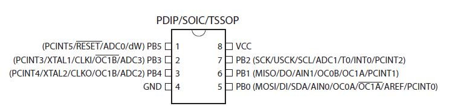
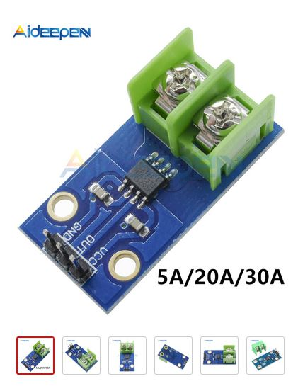

+++++++++++++++++++++++++++++++++++++++++++++++++++++++++++++++++
Hardware development documentation
+++++++++++++++++++++++++++++++++++++++++++++++++++++++++++++++++

:Auteur: J.Soranzo
:Date: Octobre 2018
:update: 08/12/2021
:version: git versionning

.. contents:: Table of Contents
    :backlinks: top

.. toctree::
   :maxdepth: 2
   :caption: Contents
   :titlesonly:

   mockup

.. |clearer|  raw:: html

    

====================================================================================================
In 2021 find on the net
====================================================================================================

TPlink

`MEROSS`_ 26€

.. _`MEROSS` : https://www.amazon.fr/Multiprise-HTbrightly-puissance3680W-Protection-surtensions/dp/B08T1DNG2R/ref=sr_1_19?__mk_fr_FR=%C3%85M%C3%85%C5%BD%C3%95%C3%91&dchild=1&keywords=meross-Multiprise-Connect%C3%A9e-Intelligente&qid=1624739465&sr=8-19

WECONN

AISIRER 

HORSKY

**KONYKS** sur AMAZON moins de 20€ et même une `prise multiple Polyco`_ moins de 60€ chez Boulanger,
AMAZON, Darty...

.. _`prise multiple Polyco` : https://www.apynov.com/konyks-polyco

.. index::
    single: TP-LINK HS110

====================================================================================================
Test of TP-Link HS110 plug with curent measurment capability
====================================================================================================
Usage of `TP-LINK HS110`_

.. _`TP-LINK HS110` : https://www.tp-link.com/en/home-networking/smart-plug/hs110/

First of all, we need to install a smartphone application KASA. What about to drive the plug directly
from a Windows, Mac or Linux computer. The plug is compatible with Alexa and IFTTT.
Above is true but with the help of Softscheck and their blog article : `Reverse Engineering the TP-Link HS110`_

.. _`Reverse Engineering the TP-Link HS110` : https://www.softscheck.com/en/reverse-engineering-tp-link-hs110/

We can do a lot of thing ! Great job and thanks to them !

The application need to connect to your wifi network and more surprisingly active your location !

You also need to creat a login on their internt site. Just to drive one simple plug !!!

Clearly it's not a product for an hobbyist. It is not open source at all

    TP-LINK HS110 

|clearer|

====================================================================================================
Et avec un Raspberry pi ?
====================================================================================================

La question se pose sérieusement avec le pi zero W (W pour Wifi) sur KuBii, il est à 10.44€ ttc

Contre environ 2.5€ pour un Wemos D1 mini

.. _hardProgress:

============
Progres
============

Terminated
----------------------------------------------------------------------------------------------------

::

#. alimentation ESP/Wemos en 5V ? : **OK**
#. horloge temps réelle : **OK**
#. bouton poussoirs : **OK**
#. Affectation des io : **OK**
#. module relais : **OK**
#. définition des modes de fonctionnement : **OK**
#. récup paramètre via form submit html : **OK**
#. add  WS2801 LED : **OK**
#. add power led **OK**
#. add power button : **OK** 
#. add wifi led : **OK**
#. add LDR : **removed**
#. add I2C nano expander with analog inputs **OK**
#. change BP to nano I2C and relay command to ESP directly (to allow turnoff relays in fatal error) **OK**
#. resolv power up problem : implement MAX1232 [ as an option onto the PCB ] **discarded**
#. implement an I2C watch dog component [ as an option onto the PCB ] **OK**
#. choix curent sensor: 75% - **discarded** in the first version
#. pcb study **OK**
#. OLED screen intefgartion **OK**
#. 5V relais board power supply  (choix du conver.) : **OK**

In progress
----------------------------------------------------------------------------------------------------

Transferred to :ref:`main todo list<mainTodoList>`

####

.. _3dLogoDesign:

====================================================================================================
3D printed Logo Design
====================================================================================================
On Inkscape

Final width goal : 32mm 

Some notes:

in Inskape choose right dimension and place on 0.0 0.0

In Freecad : 

#. separate the design in multiple svg files
#. direct in root of the new doc import svg
#. in part (not partdesign) union of the imported splines
#. in draft from curve to sketch
#. in part protusion

A lots of try with multiple comme and go between Freecad and Inkscape !

====================================================================================================
PCB bug BP2 and 3
====================================================================================================

BP2 should be on D4 and BP3 on D3 see `Input / output assignment`_

.. WARNING:: Waiting for the new version of the pcb, I switch the 2 wires on H1 female connector
   :class: without-title

.. _refRelayMainPowerSwitch:

====================================================================================================
Relais main power switching
====================================================================================================

IRF9530

|clearer|

.. list-table::
   :widths: 27 27 
   :header-rows: 1

   * - IRF9530 pinout
     - Package

   * - |aliasIRF1|
     - |aliasIRF2|

|clearer|

    High side switching 

2N7000 : N-CHANEL MOS_FET Exist in SOT-23 package ref 2N7002 :download:`datasheet<fichiersJoints/2N7002.pdf>`

Radiospares code : 671-0312 (0.30€/pcs by 20pcs)

.. WARNING:: Commande RS du 12/3/2022 7082399 this is the only reference that it was available in 50pcs.
   :class: without-title

.. WARNING:: Litige TNT

    file recorded on 26/3 : n° 8693043

    false prouf of deposit 

   

    Another one 

IRF9530 is too big replace it by a FDN340P in SOT-23 package 20V 2A

FDN340 pinout :download:`datasheet<fichiersJoints/FDN340P-1007907.pdf>`

Main relais switch conclusion
----------------------------------------------------------------------------------------------------
::

    Due to the direct main switch connection, there is no need of 2N7000 ! FDN340P is directly connected
    to the main switch

====================================================================================================
USB 5V switching
====================================================================================================
Solution with mosfet
----------------------------------------------------------------------------------------------------

.. figure:: image/espPowerschem.png
    :width: 500 px
    :figwidth: 100%
    :align: center

    ESP WEMOS D1 MINI power supply schem 

**Above solution aborted**.

With a Schotky diode
----------------------------------------------------------------------------------------------------

Schotky diode : B5817W 0.45V @ 1A

A possible power supply will be a 5.5V `AC/DC converter from ebay like this one`_

.. _`AC/DC converter from ebay like this one` : https://www.ebay.com/itm/263722458020

With this solution one schottky iss necessary for each line of powered : one for esp, one for Arduino
Nano and not for attiny wathdog (it can work correctly up to 5.5V) 

An another candidate: SS26

SS26 tested Vd = 0.3V I=90mA with 1 channel actif.

:download:`SS26 datasheet<fichiersJoints/ss22_26_datasheet.pdf>`

ESP 5V = 
mesured before diode 4.17V after 3.85v delta 0.32V

Strange why 4.17V juste à AD/DC output there is 4.97V i forget the diode !!!!

New measurement : at AC/DC converter : 4.97V,  at ESP5V input : 4.62V delta u : 0.35V

with a 5.5V AC/DC will be output : 5.15V

.. NOTE:: For ESP8266 it is no matter the real level of the 5V input because of the 3.3V embedded regulator
   :class: without-title

.. index::
    single: Watchdog; Présentation

====================
Watchdog function
====================
During multiple tests, i noticed that watch dog functionnality of the ESP8266 may fail to reset 
the component. But perhaps only when connected to usb port. **So i must made more tests.**

What are others solutions for watchdog

RTC DS3231 has a INT output but we can only set to 1 / second or 1/minutes. And it is a pour
solution to control this component to use itself !

MAX1232 has a watch dog feature but with a maximum of 1.2s and direct at startup activated.
It can't be activate after setup for example. And if we use it, we need to drive its ST pin
but all our outputs are used !

Use a I2C watchdog component as DS1371. If using this component we need to implement
a 32kHz oscillator ! `DS1374U-3+`_ (power sup 3V) or -33+ reference suffix in 3.3V available on MOUSER site for 3€23
Don't forget to buy oscillator : `32k quatz chez Mouser`_ 0.68€ !

Warning U denote a uSOP package with à 0.5mm pitch!

Perhaps DS1374 could replace MAX1232 but its VPF level is very low about 2.3V regardless of the
4.6V of the MAX1232.

`Arduino library for DS1374 here`_

An other possibility would be the usage of our NANOI2CIOExpander but watch dog function 
is not already implemented on the library (perhaps a future function).

a DS1307 or 1302 similar to DS3231 SQW/out only 1Hz

.. _`DS1374U-3+` : https://www.mouser.fr/ProductDetail/Maxim-Integrated/DS1374U-33%2b?qs=sGAEpiMZZMtpeOq%2F1QMb1SSF%252Bt1WeK6PeIGzk2pj%252BtA%3D
.. _`32k quatz chez Mouser` : https://www.mouser.fr/ProductDetail/Citizen-FineDevice/CFV-20632000AZFB?qs=byeeYqUIh0OaNx0Ju8%2FDbw==&vip=1&gclid=Cj0KCQjwyLDpBRCxARIsAEENsrJb6yYHxWLeDO4R19WO-TyqA6z7VGyO8gui8RFReQgJSRtIWyGPwV0aAsVlEALw_wcB
.. _`Arduino library for DS1374 here` : https://github.com/SpellFoundry/DS1374RTC

An other idea : use an Attiny85 as an I2C watch dog component. Library already exists ! 
`ATTiny85 I2C watchdog experiment`_ Wonderful ! But no documentation is provided except the code 
comments

.. _`ATTiny85 I2C watchdog experiment` : https://github.com/letscontrolit/ESPEasySlaves

ATtiny85 watchdog
----------------------------------------------------------------------------------------------------
After some tests, I decided to use it.

I build a ATtiny programmer with a ARDUINO UNO and a `proto shield`_ from Banggood

A little watching on the `Heliox' Youtube video`_ and it was enough to start !

So i decided for this time to stop  MAX1232 integration.

The only changes that i made in the code of the ATtiny85 watchdog are :
 - Settings.TimeOut          = 20;
 - Settings.Sleep            = 20;

An other change : I was obliged to move files in TinyWireS_Custom directory to one upper level !
 
This design works perfectly ! but what is the user license of this code ? Perhaps GNU Public 2.1

.. figure:: image/attiny_watchDog_integrationPlateform.jpg
    :width: 400 px
    :align: center
    
    ATtiny85 I2C watchdog hardware test environment

The only missing in this design is an ESP user library. So I write it !    

Power ATtiny with 3.3V and don't forget pullup on D3 and on reset (15k) ATTiny85 support 5V or 3.3V
power supplies

.. _`proto shield` : https://www.banggood.com/Arduino-Compatible-328-ProtoShield-Prototype-Expansion-Board-p-926451.html?rmmds=search&cur_warehouse=CN

.. _`Heliox' Youtube video` : https://www.youtube.com/watch?v=S-oBujsoe-Q&t=247s

**Pinout**

::

    // ATMEL ATTINY85 PINOUTS used for watchdog purpose
    //                          o-\/-+ 
    //                  Reset  1|    |8  VCC 
    //      Factory Reset Pin  2|    |7  I2C-SCL to ESP
    //      (debug) Serial TX  3|    |6  Reset output to ESP
    //                    GND  4|    |5  I2C-SDA to ESP
    //                          +----+ 

ATTiny85 programming tips
----------------------------------------------------------------------------------------------------
Don't forget to choose clock 1MHz for ATTiny when programming with ARDOUINO UNO as IoT_EPS
This is not specify in the documentation

14/11/2021 : try the best result was internal clock 1MHz : times1s give 1s but com speed always 1200
not 9600

ATiny85 watchdog test tips
----------------------------------------------------------------------------------------------------
There is a TX debug serial on pin 3  speed is en théorie 1200 but on my maquette 9600 !!!

facteur 8 => fuse atiny85 ???? 11/11/2021 NO I test the 3 speed 1, 8 and 16MHz and the com speed is 
always 1200 bauds !!!!

The name of the project of the Atiny code is ESPEasySlaves.

Only for my eyes the code sits in ::

    0044-Iot_ESP_PPlug\projet\_3_software\etudeDeCode (not pushed in github).

.. index::
    single: Watchdog; Problème

ATTiny watchdog expertise
----------------------------------------------------------------------------------------------------
Date: 20/11/2021: I can't reproduce watchdog component with the data that I have.

On the maquette there is an ATTiny programmed. It run perfectly @ 9600 bauds on debug COM.

But when I program a new component with the design that site on my hard drive, I can't obtain a 
functional one.

The ATtiny programmed work @1200bds when I set 1MHz for ATTiny in ARDUINO IDE

I decide to conduct more test en check the size of the bit on serial. Short explain: in the design
there is a special lib for serial that it is more lower than the official one but manually tuned.

First test : with the functional one (the master) check on oscillo the serial bit duration.

Bit size 102us (putty @9600 bd works perfectly)

Test program with  8MHz as cpu clock in ADUINO IDE : Serial comm is at 1200 bauds but timer1s is about 6s duration !

Test @ 1MHz : rs 1200 timer1s = 1s

**ATTiny hex dump**

With what tools ? Visual Atmel, AVRdude

- Atmel Studio 

- avrdude : in ``C:\Program Files (x86)\Arduino\hardware\tools\avr\bin``

Probe::

    AVRMKII
    USBasp

Video ressource : `#002|English - avrdude, USBasp, Atmel Studio, Arduino IDE, fuses, lockbits, hex, ...`_

.. _`#002|English - avrdude, USBasp, Atmel Studio, Arduino IDE, fuses, lockbits, hex, ...` : https://www.youtube.com/watch?v=lxUmaW9M4EI

Command avrdude::

    avrdude -c usbasp -p t85 -t : enter terminal mode
    avrdude -c usbasp -p t85 -U flash:r:m128_read.hex:i

http://undindoncurieux.blogspot.com/2015/12/charger-un-driver-usbasp-sur-windows-10.html

Micro task:

- install driver usbasp_pinning : necessary ? nothing in  "Le journal de manip" **OK**
- wire it on a breadboard
- read wrong component **OK**
    - read hex file composant **OK**
    - read fuses **OK**
- read the right component **OK**

**avrdude and its conf file on E:\avrdude** !!!! Otherwise it reports errors:: 

    avrdude: can't open config file "": Invalid argument
    avrdude: error reading system wide configuration file ""

avrdude command send by Arduino IDE to the ARDUINO as ISP::

    avrdude -v -pattiny85 -cstk500v1 -PCOM12 -b19200 -Uflash:r:TinyI2CWatchdog_nonFonctionnel.hex:i

Above commands are cleaned of the fullpath

First diff right component Lfuse = E2 and wrong one Lfuse = 62 meaning that the right comp is clocked at 8Mhz

After a lot of time spend on this expertise **I decide to stop it without solution** !

I keep binary files from the right component as a master to program others components !

.. index::
    single: Watchdog; Program from bin files

.. _refWatchdogProg:

Program Attiny85 from binary files
----------------------------------------------------------------------------------------------------
Use ARDUINO as ISP as in the Heliox video see her above. The wiring diagram is a 2:11 in the video.

And after this preparation, we can program component directly with avrdude in command line.
Without ARDUINO IDE. There is only one constraint: the avrdude.conf file need to resid in the same
directory than our .hex master file.

read fuse with avrdude::

    
    avrdude -v -pattiny85 -cstk500v1 -PCOM16 -b19200 -U lfuse:r:-:i

    -U <memtype>:r|w|v:<filename>[:format]
                                Memory operation specification.
                                Multiple -U options are allowed, each request
                                is performed in the order specified.

    v for verification
    memtype : lfuse, efuse, hfuse, signature, flash, eeprom
    format: i for intel hex there is a lots of other formats

https://www.nongnu.org/avrdude/user-manual/avrdude_3.html#Option-Descriptions

above commnd produce::

    avrdude: Version 6.3-20171130
            Copyright (c) 2000-2005 Brian Dean, http://www.bdmicro.com/
            Copyright (c) 2007-2014 Joerg Wunsch

            System wide configuration file is "C:\Users\jojo\Documents\jojoBag\perso\0044-Iot_ESP_PPlug\projet\_3_software\ESPEasySlaves\avrdude.conf"

            Using Port                    : COM16
            Using Programmer              : stk500v1
            Overriding Baud Rate          : 19200
            AVR Part                      : ATtiny85
            Chip Erase delay              : 400000 us
            PAGEL                         : P00
            BS2                           : P00
            RESET disposition             : possible i/o
            RETRY pulse                   : SCK
            serial program mode           : yes
            parallel program mode         : yes
            Timeout                       : 200
            StabDelay                     : 100
            CmdexeDelay                   : 25
            SyncLoops                     : 32
            ByteDelay                     : 0
            PollIndex                     : 3
            PollValue                     : 0x53
            Memory Detail                 :

                                    Block Poll               Page                       Polled
            Memory Type Mode Delay Size  Indx Paged  Size   Size #Pages MinW  MaxW   ReadBack
            ----------- ---- ----- ----- ---- ------ ------ ---- ------ ----- ----- ---------
            eeprom        65    12     4    0 no        512    4      0  4000  4500 0xff 0xff
            flash         65     6    32    0 yes      8192   64    128 30000 30000 0xff 0xff
            signature      0     0     0    0 no          3    0      0     0     0 0x00 0x00
            lock           0     0     0    0 no          1    0      0  9000  9000 0x00 0x00
            lfuse          0     0     0    0 no          1    0      0  9000  9000 0x00 0x00
            hfuse          0     0     0    0 no          1    0      0  9000  9000 0x00 0x00
            efuse          0     0     0    0 no          1    0      0  9000  9000 0x00 0x00
            calibration    0     0     0    0 no          1    0      0     0     0 0x00 0x00

            Programmer Type : STK500
            Description     : Atmel STK500 Version 1.x firmware
            Hardware Version: 2
            Firmware Version: 1.18
            Topcard         : Unknown
            Vtarget         : 0.0 V
            Varef           : 0.0 V
            Oscillator      : Off
            SCK period      : 0.1 us

    avrdude: AVR device initialized and ready to accept instructions

    Reading | ################################################## | 100% 0.04s

    avrdude: Device signature = 0x1e930b (probably t85)
    avrdude: safemode: lfuse reads as E2
    avrdude: safemode: hfuse reads as DF
    avrdude: safemode: efuse reads as FF
    avrdude: reading lfuse memory:

    Reading | ################################################## | 100% 0.01s

    avrdude: writing output file "<stdout>"
    :01000000E21D
    :00000001FF

    avrdude: safemode: lfuse reads as E2
    avrdude: safemode: hfuse reads as DF
    avrdude: safemode: efuse reads as FF
    avrdude: safemode: Fuses OK (E:FF, H:DF, L:E2)

    avrdude done.  Thank you.

Fuse for a clean component::

    avrdude: safemode: lfuse reads as 62
    avrdude: safemode: hfuse reads as DF
    avrdude: safemode: efuse reads as FF
    avrdude: safemode: Fuses OK (E:FF, H:DF, L:62)

For right comp::

    avrdude: safemode: lfuse reads as E2
    avrdude: safemode: hfuse reads as DF
    avrdude: safemode: efuse reads as FF
    avrdude: safemode: Fuses OK (E:FF, H:DF, L:E2)

Command to write lfuse::

    avrdude -v -pattiny85 -cstk500v1 -PCOM16 -b19200 -U lfuse:w:0xE2:m
    note m format as ``immediate mode; actual byte values specified on the command line``

Command to write binary file::

    avrdude -v -pattiny85 -cstk500v1 -PCOM7 -b19200 -U flash:w:TinyI2CWatchdog_rightComponent211127_2223.hex:i   

----------------------------------------------------------------------------------------------------

MAX1232 integration (aborted)
----------------------------------------------------------------------------------------------------

MAX1232 is a uP supervisor. It features bp and watchdog

.. figure:: image/MAX1232pinout.png
    :align: center
    
    MAX1232 pinout
    
    
Very simple : connect VCC, GND and RST/ to RST pin of the 8266 !

Add a pullup on RST/. Also pullup TOL pin 3 (tolerance 10%), pin 7 WD input and pin 1 PBRST/

Warning MAW1232 check power supply in 5V+/-5% ie 4.75 to 5.25V

Aborted because : timeout settings of 150ms, 600ms, or 1.2s (to short for us)

====================================
Direct relay connection to ESP pins
====================================
On a first stage, relays were connected to nano and Push Button were directly connected to ESP8266.
The purpose is to connect relays to ESP8266 and push button to nano.

Cause when there is an error on I2C bus relay commands are no accessibles and we can't switch 
it off with main power switch.

List of change:
 - IoT_EPS.h Pinning
 - void bouton::begin( int boutonPin ) : pinMode(boutonPin, INPUT_PULLUP); _nano.pinMode
 - void bouton::update() : large changes digitalRead to _nano.digitalRead (group in one line)
 - bool bouton::directRead() => one _nano.digitalRead.
 - void CPowerPlug::begin : one line     _nano.pinMode( _pin, OUTPUT ); to normal pinMode 
 - void CPowerPlug::updateOutputs : one line to change
 
A failure (work branch : relayChange) because some of the ESP8266 pins have others usages that are
not compatibles with relay command. Specaly D3 and D4 respectively IO-0 and IO-2 that are used 
during the reset and that changes state. So we leave this work on its branche and return to the previous
configuration with relay commands connected to the NanoI2CIOExpander.

Others solutions to solve our problem:

#. use a WEmos ESP32 with more IO (perhaps we can remove NanoI2CIOExpander...)
#. use another relay or a transitor MOS to switch off the 5V Power supply of the relay commands.
   This new relay would be drive directly by the Main Power Switch

Problem solved with the second solution.

============================
AC power plug in the world 
============================

It's incredible !

See in `wikipedia power plug`_

and in French : `prises secteur sur wikipedia`_

.. _`wikipedia power plug` : https://en.wikipedia.org/wiki/AC_power_plugs_and_sockets

.. _`prises secteur sur wikipedia` : https://fr.wikipedia.org/wiki/Prise_%C3%A9lectrique#Plusieurs_normes_diff%C3%A9rentes

####

.. index::
    single: Power supply

==================   
ESP power 
==================
First question: can we power ESP8266 with 5V external power  ?

Answer : yes

    
    Power schematic of WEMOS D1 mini

Can we power ESP with external 5V and USB at the same time ?

    
    Power schematic of WEMOS D1 mini USB input

The USB input is protected by a diode, ok

But our external power is not. All +5V are connected together so USB will power all the board and
relays. It is not very good. We should put a diode between 5V of ESP and the rest of the board.
In this way, external power could power ESP but +5V power from ESP could not power the rest of the
plug.

And what about 3.3V ? It come from ESP regulator to power few I2C components like:

- RTC
- Tiny85 who could work with 5v but to drive ESP input it is better to power ATiny with 3.3v

####

================================
ESP8266 power up problem
================================
When I power Wemos by external 5V, the system don't start correctly.

Apparently it stay locked in an unknow state for about 6 seconds and finaly it start.

I suspect a watch dog time out.

I try to put à 47uF on reset. With oscilloscope I watch the signal and I thinks that the slew rate
is to low.

I consider to add a MAX1232 on the reset pin or an analog circuit.

I checked IO0 (D3) used to flash the component is connect to BP3

At the begin of the setup I add a delay during this delay i drive the built-in LED for 1s 
and it solves the problem ! Very strange behavior !

==========================
Real time calendar clock
==========================

Adding of a DS3231 as in the project : `ESP_NTP_DS3231 <https://github.com/volab/ESP_NTP_DS3231>`_

.. important::

  D1 : SCL
  D2 : SDA
  
I2C pullup ? There is pull up on DS3231 ! Yes I checked it 4.7k

Power consumption : 1.9mA measured 08/03/19

####

=======================
Current sensor choice
=======================

Great youtube video on this subject from Andreas Spiess (the guy with the swiss accent)

`#245 Deep-Sleep Current: Which is better? µCurrent or CurrentRanger? (ESP32, ESP8266)`_

.. _`#245 Deep-Sleep Current: Which is better? µCurrent or CurrentRanger? (ESP32, ESP8266)` : https://www.youtube.com/watch?v=HmXfyLyN38c

`#321 7 Sensors tested: Measuring Current with Microcontrollers (Arduino, ESP32, ESP8266)`_

.. _`#321 7 Sensors tested: Measuring Current with Microcontrollers (Arduino, ESP32, ESP8266)` : https://www.youtube.com/watch?v=cG8moaufmQs

INA219 et INA220 : NOT KEPT : bus voltage to low
----------------------------------------------------------------------------------------------------

- impossible "bus voltage 0-26V"

ACS712 : ANALOG OUTPUT
----------------------------------------------------------------------------------------------------

- "Output voltage proportional to AC or DC currents"

- "2.1 kVRMS minimum isolation voltage from pins 1-4 to pins 5-8"

- "5V power supply"

pb it is not I2C compnent and more we need 4

3 version exist -05 -20 -30 for 5A, 20A, 30A.

On Banggood there are :
  - `Banggood ACS712 5A version`_
  - `Banggood ACS712 30A version`_
  - `20A version on AliExpress`_
  
  20A version output a 100mV/A

.. _`Banggood ACS712 5A version`: https://www.banggood.com/ACS712TELC-05B-5A-Module-Current-Sensor-Module-For-Arduino-p-74020.html?akmClientCountry=FR&&cur_warehouse=CN
.. _`Banggood ACS712 30A version` : https://www.banggood.com/1PC-30A-New-Range-Current-Sensor-Module-for-ACS712-p-86583.html?rmmds=search&cur_warehouse=CN
.. _`20A version on AliExpress` : https://fr.aliexpress.com/item/32315336227.html

.. NOTE::
    5A version is  a rail to rail value +/-5A but we need to mesure RMS value 5A/sqr(2) = 3.53A.
    With a 20A value it means that we have 14.14A with 100mV/A factor it risk to be very low
    mesurement for small curent values. for exemple: for a 100mA we need to mesure 10mV.

ACS764 : NOT KEPT : DC
----------------------------------------------------------------------------------------------------
I can't find rail to rail max  voltage

- I2C
- max courant  programmable
- but Unidirectional DC current sensing and reporting : KO

Internet search
----------------------------------------------------------------------------------------------------

"AC isolated current sensor I2C"

The winer (not in 2019 !) is `Si8901B-GS`_

.. _`Si8901B-GS` : https://www.silabs.com/products/isolation/current-sensors/si890x-isolated-adc-ac-mains-monitor

dispo on `Mouser`_ à 3.44€/10pcs

.. WARNING::

    It requires a 3.3V power supply referenced to Neutral line ! (see fig16 page 24 in its datasheet)

.. _`Mouser` : https://www.mouser.fr/Search/Refine.aspx?Keyword=SI8901 

`Usage example`_ of an HLW8012. Open source example

.. _`Usage example` : http://tinkerman.cat/the-espurna-board-a-smart-wall-switch-with-power-monitoring/#lightbox-gallery-oY6vOUw7/3/

Finaly, now that we have on board NANOI2CIOExpander that provide 6 analog inputs we can use ACS712.

.. warning::

    For me, most of breakout boards provide on internet have an isolation issue. The ground plane comes very close to AC terminal (less than 1 mm)

.. figure:: image/ACS712wrongModul.jpg
   :width: 500 px
   :figwidth: 100%
   :alt: alternate text
   :align: center
   
   ACS712 wrong breakout board 

Specialy those with mounting holes. Its is mode revelant from back side:

   
   ACS712 wrong breakout board back side      

   
   ACS712 a good breakout board
     
.. figure:: image/backSideViewAdeepin.jpg
   :width: 500 px
   :figwidth: 100%
   :alt: ACS712 a good breakout board back
   :align: center
   
   ACS712 a good breakout board back

More connector are bigest than on the other modules and they arive not solder. There is 2 big holes 
on pcb to connect directly large wires for 30A curent. the size oh this holes is about 2.9mm.

`aliExpress good module provided in 5A grade`_ or `another one`_

.. _`aliExpress good module provided in 5A grade` :  https://fr.aliexpress.com/item/4000114853244.html?spm=a2g0o.productlist.0.0.66ea5b1eF7t2X4&algo_pvid=1b39f4cd-fbad-4e1e-9dde-36822b81eafc&algo_expid=1b39f4cd-fbad-4e1e-9dde-36822b81eafc-34&btsid=b1b106c8-8af6-4248-a717-bc9083416f7d&ws_ab_test=searchweb0_0,searchweb201602_1,searchweb201603_52   

.. _`another one` : https://fr.aliexpress.com/item/32649182582.html?spm=a2g0o.productlist.0.0.66ea5b1eF7t2X4&algo_pvid=1b39f4cd-fbad-4e1e-9dde-36822b81eafc&algo_expid=1b39f4cd-fbad-4e1e-9dde-36822b81eafc-26&btsid=b1b106c8-8af6-4248-a717-bc9083416f7d&ws_ab_test=searchweb0_0,searchweb201602_1,searchweb201603_52   

First test with ACS712
----------------------------------------------------------------------------------------------------
With my new received ACS712 5A breakout board, i made a first test with oscilloscope, multimeter
and a motor as a charge ( with the drill press of the lab).

Multimeter measure 0.793A

   

   
   Curent measurment without load

   
   Curent measurment with motor

185mV/A we can see that the measurment will be not very precise and very noisy !

For 5A it give 5x185 = 925mV above and under 2.5V

   
New ASC723 : to try
----------------------------------------------------------------------------------------------------
Replacement part for ACS712 find on the Allegro web site

"The Allegro™ ACS723 current sensor IC is an economical and
precise solution for AC or DC current sensing in industrial,
commercial, and communications systems." from datasheet.

But... It is not very widespread. It is available only on SPARKFUN and distribute by MOUSER

`SPARKFUN`_ provide 2 breakoutboard. On one there is a smal AOP for `low current version`_.

`at MOUSER`_

I find an another problème : the price 4.65€ an we need 4 ! Tips : breakout board for ACS712 should be compatible !

The component alone is available `on Radiospares site`_.

But an improuvment is the sensitivity for +/-5A version we pass from 185mV/A for ACS712 to 400mV/A.

An other improvment there is a +/-10A version ACS723LLCTR-10AB-T but it is very expensive 
5.81€ with VAT regarless of the ASC712.

.. _`SPARKFUN` : https://www.sparkfun.com/products/13679

.. _`low current version` : https://www.sparkfun.com/products/14544

.. _`at MOUSER` : https://www.mouser.fr/ProductDetail/SparkFun/SEN-13679?qs=sGAEpiMZZMth%2FZucVH%252BQV%252BqTLTi3I91PHEyo95sZVRRnBMCmkoQqnQ%3D%3D 

.. _`on Radiospares site` : https://fr.rs-online.com/web/p/capteurs-de-courant/8660760/

TMCS1100 from ti : NOT KEPT : no breakoutboard t test it
----------------------------------------------------------------------------------------------------

No breakout board on the net !

ACS70331

.. current sensing aborted:

Current Sensing Aborted
----------------------------------------------------------------------------------------------------
For now, we abort the idea of sensing the curent in each chanel of the IoT EPS because we can't find
a good solution that match the main criteria:

- ability to measure low and high current from 0.01A to 10A True RMS on AC240V suply without neutral
  reference.

So we decide to continue the rest of the project without this feature but we keep it in mind.

For remembering, current measurment covers 2  needs:

#. check if the 2 relais on one channel have switched correctly
#. provide power consumption informations to the user

For the first one we can measure voltage with a module like this :

   
See `Module AC on AliExpress`_ with voltage lower transformer

.. _`Module AC on AliExpress` : https://fr.aliexpress.com/item/32816455579.html

This solution is more easy to implement even at the end of the project because voltage measurement 
are made in parallel and there is only one value to measure prensence of the 240V.

An other way to do ti is to use SFH6206 as on `Electrical Engineering forum`_ but this solution
requires interrupt pin that we don't have here ! We have only analog pin on the ARDUINO nano !

.. _`Electrical Engineering forum` : https://electronics.stackexchange.com/questions/17008/how-can-i-detect-a-power-outage-with-a-microcontroller

MAX71020A a new hope 
----------------------------------------------------------------------------------------------------
In february 2020, I find a new component to measure AC curent circuit spécialisé sur bus SPI.

Pb seems to be obsolescence in a near future... Dommage 4.11€ `at Mouser.com`_

Replace part on Maxim's site ? 78M6613 reference sold to SILERGIE ? obso Stok 0 on Mouser

A very short time new hope :-(

.. _`at Mouser.com` : https://www.mouser.fr/ProductDetail/Maxim-Integrated/MAX71020AETI%2b?qs=%2Fha2pyFaduhbncrMXO3FSjhx%252BjRn69riAjwSGzocCvw%252Bj%2FNqq3%2F7JvLM9vZohPbP

MCP3911
----------------------------------------------------------------------------------------------------
In Linky !

 1€64 @MOUSER

Shunt mesurment

----------------------------------------------------------------------------------------------------

.. index::
    pair: Hardware; Relay choice

=======================
Relay board choice
=======================

Coupure des 2 voies en même temps (phase et neutre) donc soit des relais 2 voies soit 8 relais.

Nous avons retenu l'option 8 relais car plus disponible dans l'écosphére ARDUINO.

The real need is a DPST relay but its very difficlut to find more with a 5V cmd and not with 
a breakout board form. A possible solution would be to make our own relays pcb.

Disponible entre autres chez `Banggood 8 Channel Module Module Relais`_ 

.. _`Banggood 8 Channel Module Module Relais` : https://www.banggood.com/fr/5Pcs-5V-8-Channel-Relay-Module-Board-For-Arduino-PIC-AVR-DSP-ARM-p-968931.html?rmmds=detail-left-hotproducts__2&cur_warehouse=CN

    
    Photo module relais 8 voies de chez Banggod
    
Le gros soucis avec ces modules c'est que les relais sont actif par défaut.

On pourrait utiliser le contact repos, mais il y a un petit risque d'avoir une micro alimentation
des équipements derrière la prise pendant quelques milisecondes.

Solution : inversé le signal de commande avec 4 2N7000 à 0.24€ chez RS particulier

la bobine est données pour 70ohm sous 5V soit I environ 75mA * 8 = 571mA

Nous avons mesuré 156mA pour 2 relais ce qui donnerais 624mA pour les 8 soit un convertisseur 
AC/DC capable de délivrer 3.2W

Livetime of the relays
----------------------------------------------------------------------------------------------------
 10^7 time 

===================================
Livetime of ESP8266 flash SPIFFS
===================================
hypothesis :
- 4 plugs that work in clycle mode 1 minutes on and 1 minutes off
- 4 plugs not synchronyzed
With this hyp. the 4write/minutes 

WEMOS D1 Flash is Ai ESP12-F module W25Q32 pour 32Mbits soit 4Mo
100k erase/write cycle

25k minutes = 416 hours = 17 days

But it is a very hard hypothesis

A great question : what is the realistic usage ?

- one On/off cycle by hour on each plug every days only 12 hours by days
  25k hours /12 <=> 2083 days <=> more than 5 years
 

----------------------------------------------------------------------------------------------------

.. index:: Pining, IO connections

==========================================
Input / output assignment 
==========================================

.. figure:: image/wemos-d1-mini-pinout_avecI2C.png
    :width: 600 px
    :align: center
    
    Wemos D1 Mini pinout

.. table:: IO Assignment
    :align: center
    
    ===== =============  =====================
    pins  Assignment     ESP-GPIO
    ===== =============  =====================
    D0    Main Power sw  IO16
    D1    I2C SCL        IO5
    D2    I2C data       IO4
    D3    BP3            IO0 - Warning PU10k
    D4    BP2            IO2 - PU10k
    D5    BP1            IO14
    D6    BP0            IO12
    D7    DATA WS2801    IO13           
    D8    CLK WS2801     IO15 - PD10k    
    ===== =============  =====================

.. index:: Nano I2C IO Expander, I2C IO Expender

- GPIO16: pin is high at BOOT
- GPIO0: boot failure if pulled LOW
- GPIO2: pin is high on BOOT, boot failure if pulled LOW
- GPIO15: boot failure if pulled HIGH
- GPIO3: pin is high at BOOT
- GPIO1: pin is high at BOOT, boot failure if pulled LOW
- GPIO10: pin is high at BOOT
- GPIO9: pin is high at BOOT

Source : sur `RandomeredTutorial ESP8266 pinout`_

.. _`RandomeredTutorial ESP8266 pinout` : https://randomnerdtutorials.com/esp8266-pinout-reference-gpios/

----------------------------------------------------------------------------------------------------

.. _nanoI2CIoExpander:

.. index::
    pair: Hardware; IO Expander

===========================
nanoI2CIOExpander
===========================
To solve digital I/O and analog I decide to use an ARDUINO nano as I2C slave. I belived that someone
like ADAFRUIT or SPARFUN has build a lib to use an ARDUINO Nano as `I2C I/O expander`_.

To my surprise, nobody does it ! So I wrote it and I provide it on `HACKSTER IO`_

.. _`I2C I/O expander` : https://www.hackster.io/MajorLeeDuVoLAB/nano-i2c-io-expander-3e76fc

.. _`HACKSTER IO` :  https://www.hackster.io/MajorLeeDuVoLAB/nano-i2c-io-expander-3e76fc

Nano pining :

.. table:: ARDUINO Nano I2C I/O Expander pins assignment
    :align: center
    
    ===== ======= =============
    pins   Name    affectation
    ===== ======= =============
    D2       0     PLUG0-ROUGE
    D3       1     PLUG1-VERT
    D4       2     PLUG2-BLEUE
    D5             PLUG3-JAUNE
    D6             LED0
    D7             LED1
    D8             LED2
    D9       7     LED3
    D10      8     WIFI LED 
    D11      9     MAIN POWER LED
    D12      10    Special BP
    A0            PLUG0 Current
    A1            PLUG1 Current
    A2             PLUG2 Current
    A3             PLUG3 Current
    A6    
    A7
    ===== ======= =============

    

####

==========================================
BOM (obsolete 10/06/2021)
==========================================

- Carte 8 relais banggood 4.57
- 4 BP 0.2€ = 0.8€
- 1 ESP8266 WEMOD D1 mini : 2.81€
- 1 NANO V3 2.28€
- 4 Prises 1.9€ = 7.6€
- morceau de goulotte

Sous Total = 18.06€

- 4 mesure de courant 7.27€ = 29.08€

Total = 47.14

- 4 ACS712 isolated 3.99€ `sur aliexpresse`_

.. _`sur aliexpresse` : https://fr.aliexpress.com/item/ACS714-5A-20A-30A-5-v-Isoler-Capteur-De-Courant-Carte-de-D-rivation-Filtre-R/32865669250.html

- Autre ACS712 mieux isolé `toujours sur aliexpress`_ par 10pcs 2.62€/pcs fdp compris soit 4x2.62 = 10.48

.. _`toujours sur aliexpress` : https://fr.aliexpress.com/item/20A-Range-ACS712-Current-Sensor-Module-AC-Current-Sensor-DC-Hall-Current-Sensor-module-for-Arduino/32649182582.html?spm=a2g0w.search0204.3.84.73c22411wAFPs5&ws_ab_test=searchweb0_0,searchweb201602_5_10065_10068_319_5735015_10892_317_5734915_10696_10924_453_10084_454_10083_10618_10920_10921_10304_10922_10307_10820_10821_537_10302_536_5730115_10843_10059_10884_10887_100031_5735215_321_322_10103_5729115_5735115_10930,searchweb201603_51,ppcSwitch_0_ppcChannel&algo_expid=5ef8197b-2bdc-48f7-8a9b-d8edf6a406b9-11&algo_pvid=5ef8197b-2bdc-48f7-8a9b-d8edf6a406b9

 ce qui nous amènerait à 28.54€
 
- +4 led rouge d3mm
- +1 current fault
- +5 résistance 330ohm
- +4 LED neopixel `diam 8mm sur aliexpress`_ 4x0.23€
- +1 HLK-PM01 AC/DC 220V/5V seulement 3W soit 0.6A 3.03€ (un peu juste voir § `Relay board choice`_ )
- Fuse et porte fuse
- DS3231 avec batterie
- 4 x `2N7000 chez RS PArticulers`_

.. _`2N7000 chez RS PArticulers` : https://www.rs-particuliers.com/Search.aspx?Terms=671-4733&Page=0

.. _`diam 8mm sur aliexpress` : https://fr.aliexpress.com/item/20pcs-14mm-8mm-F8-DC5V-WS2801-2801-IC-diffused-RGB-LED-for-Pixel-LED-Module-Light/1966017933.html#!

5V power supply

https://www.banggood.com/5pcs-AC-DC-5V-2A-10W-Switching-Power-Bare-Board-Stabilivolt-Power-Module-AC-100-240V-To-DC-5V-p-1190175.html?rmmds=detail-left-hotproducts__3&cur_warehouse=CN

5pcs 6.03€

https://www.banggood.com/AC-DC-5V-2A-Switching-Power-Supply-Board-Low-Ripple-Power-Supply-Board-10W-Switching-Module-p-1337342.html?rmmds=search&cur_warehouse=CN

3€26 /pcs

https://www.banggood.com/220V-to-5V-5W-AC-DC-Isolation-Switch-Power-Supply-Module-p-1420417.html?rmmds=detail-bottom-alsobought__4&cur_warehouse=CN

3€23 seulement 1A mais à souder sur CI

====================
Useful Documentation
====================

Examples 

SONOF POW on `CNX software`_

SONOF POW on `the SONOF site`_

`The ESPurna board`_ : very interresting !

`Smart Switch Having 6 Outputs & 5 Inputs`_ : 

`How can I detect a power outage with a microcontroller?`_ 

.. _`The ESPurna board` : https://tinkerman.cat/post/the-espurna-board-a-smart-wall-switch-with-power-monitoring#lightbox-gallery-oY6vOUw7/3/

.. _`CNX software` : https://www.cnx-software.com/2017/04/09/espurna-h-is-a-compact-open-source-hardware-board-with-esp8266-wisoc-a-10a-relay-hlw8012-power-monitoring-chip/

.. _`the SONOF site` : https://sonoff.itead.cc/en/products/sonoff/sonoff-pow

.. _`Smart Switch Having 6 Outputs & 5 Inputs` : https://www.hackster.io/ashish_8284/smart-switch-having-6-outputs-5-inputs-91fc29?utm_campaign=new_projects&utm_content=1&utm_medium=email&utm_source=hackster&utm_term=project_name

.. _`How can I detect a power outage with a microcontroller?` : https://electronics.stackexchange.com/questions/17008/how-can-i-detect-a-power-outage-with-a-microcontroller

====================================================================================================
PCB dev
====================================================================================================
Tools : `EasyEDA.com`_

.. _`EasyEDA.com` : https://easyeda.com/editor#id=69115a0a3c0e4fc9a7f6cf54611fa6d4|2b73c76a246e4b2a8ebcf58152a8890c

:download:`Schéma<../../_4_PCB/easyeda/Schematic_IoT Electrical Power Strip_Sheet_1_20200208225752.pdf>`

2 versions of the PCB :

RED one and Blue one lol

modification to pass from old pcb to new pcb (v2):

    - PBHEADER : no change (perhaps PB2 PB2 switched)
    - ONOFF HEADER : **no change**
    - SPECIAL BP : **no change**
    - I2C HEADER : **no change**
    - RTC HEADER : *no change*
    - 4COLOR LED HEADER : *no change* 
    - WIFI AND POW LED : groupe on the same connector
        - 1 = is Wifi, 2 power led and 3 GND **OK**
    - red LEDHEADER : from 8 to 5 **OK**
        - pin are in the same order 1 to 1, 3 to 2, 5 to 3, 7 to 4 and 8 to 5 **OK**
        - remove résistors directly connected to the leds in front panel ! **OK**
    - change relay connector from 10 pin to 6 **OK**
        - 1 to 1, 2 to 2, 4 to 3, 6 to 4, 8 to 5, 10 to 6 (GND) **OK**

.. _refDetect220VPres:

====================================================================================================
Easy check 220V presence
====================================================================================================

With a SFH6206 see `How can I detect a power outage with a microcontroller?`_

This technique générate an high to low when ac cross the zero. 

An other possibility mentionned in this article will be MID400.

I have SFH620A-2. :download:`datasheet of the component<fichiersJoints/sfh620a.pdf>`

Protection resistor calculations:

If = +/-60mA Vf = 1.25V

Collector curent : 50mA

Check Resistor power dissipation

Check Resitor breakdown voltage

=============
Weblinks
=============

.. target-notes::