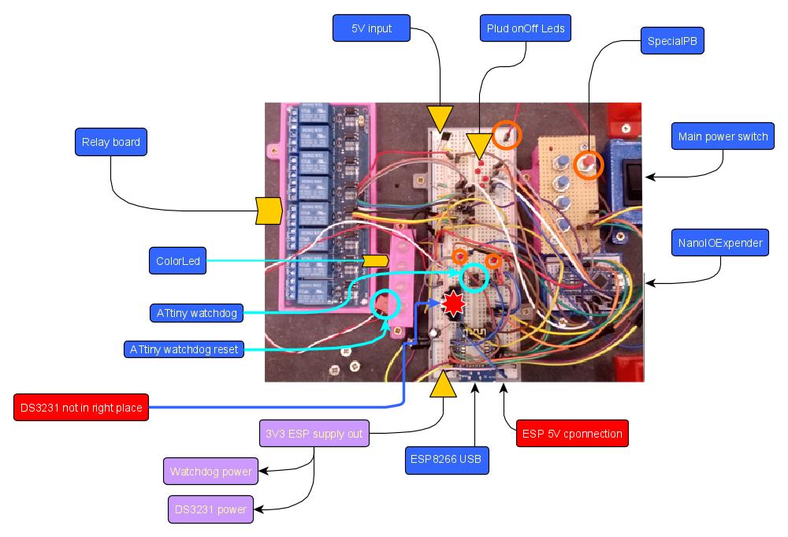

++++++++++++++++++++++++++++++++++++++++++++++++++++++++++++++++++++++++++++++++++++++++++++++++++++
Mock-up information
++++++++++++++++++++++++++++++++++++++++++++++++++++++++++++++++++++++++++++++++++++++++++++++++++++

:Auteur: J.Soranzo
:Date: Jully 2020
:Societe: VoRoBoTics
:Entity: VoLAB

.. contents::
    :backlinks: top

====================================================================================================
Constitution
====================================================================================================

====================================================================================================
Useful tips
====================================================================================================
5V power supply for the ESP

.. warning::
    Disconnect this power supply when ESP is connected via USB

Switch on power supply first, before PC USB connection

When powered and no led light expect ArduinoI2Cioextension, switch main power to on ;-)

====================================================================================================
Weblinks
====================================================================================================

.. target-notes::
