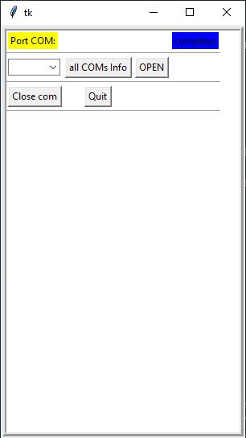
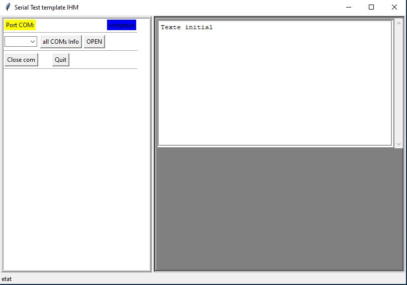

++++++++++++++++++++++++++++++++++++++++++++++++++++++++++++++++++++++++++++++++++++++++++++++++++++
Pythons fine-tuning tools
++++++++++++++++++++++++++++++++++++++++++++++++++++++++++++++++++++++++++++++++++++++++++++++++++++

:Auteur: J.Soranzo
:Date de création: 06/2022
:Date dernière maj: 06/2022
:Societe: VoRoBoTics
:Entity: VoLAB

.. contents::
    :backlinks: top

====================================================================================================
boot record
====================================================================================================
Below all different tests made.

historique211027_2241.txt::

    ...projet\_3_software\outilPythonSpecial>python
    Python 3.8.3 (tags/v3.8.3:6f8c832, May 13 2020, 22:20:19) [MSC v.1925 32 bit (Intel)] on win32
    Type "help", "copyright", "credits" or "license" for more information.
    >>> exit()

    ...projet\_3_software\outilPythonSpecial>dir
    Le volume dans le lecteur C n’a pas de nom.
   

    Répertoire de ...projet\_3_software\outilPythonSpecial

    23/10/2021  23:04    <DIR>          .
    23/10/2021  23:04    <DIR>          ..
    27/10/2021  21:48               900 recordBootSeq.py
                1 fichier(s)              900 octets
                2 Rép(s)  282 681 319 424 octets libres

    ...projet\_3_software\outilPythonSpecial>python recordBootSeq.py
    ********************************************************************************
    Records boot sequence at serial COM4
    ********************************************************************************
    <generator object comports at 0x01F72A00>
    None
    None
    None
    List des ports : []
    Le port n'est pas dans la list
    Try to open serial
    Serial is open ? True

    ...projet\_3_software\outilPythonSpecial>python
    Python 3.8.3 (tags/v3.8.3:6f8c832, May 13 2020, 22:20:19) [MSC v.1925 32 bit (Intel)] on win32
    Type "help", "copyright", "credits" or "license" for more information.
    >>> import Serial
    Traceback (most recent call last):
    File "<stdin>", line 1, in <module>
    ModuleNotFoundError: No module named 'Serial'
    >>> import serial
    >>> import serial.tools.list_ports
    >>> ports = serial.tools.list_ports.comports()
    >>> ports
    <generator object comports at 0x012A2A00>
    >>> print(ports)
    <generator object comports at 0x012A2A00>
    >>> exit()

    ...projet\_3_software\outilPythonSpecial>python recordBootSeq.py
    ********************************************************************************
    Records boot sequence at serial COM4
    ********************************************************************************
    <generator object comports at 0x01DD2A00>
    COM9 - Lien série sur Bluetooth standard (COM9)
    None
    COM4 - USB-SERIAL CH340 (COM4)
    None
    COM8 - Lien série sur Bluetooth standard (COM8)
    None
    List des ports : []
    Le port n'est pas dans la liste
    Try to open serial
    Serial is open ? True

    ...projet\_3_software\outilPythonSpecial>conda info -e
    # conda environments:
    #
    base                  *  *************\miniconda3
    envTest2.7               *************\miniconda3\envs\envTest2.7
    rasatest                 *************\miniconda3\envs\rasatest
    test                     *************\miniconda3\envs\test

    ...projet\_3_software\outilPythonSpecial>conda activate test

    (test) ...projet\_3_software\outilPythonSpecial>python recordBootSeq.py
    ********************************************************************************
    Records boot sequence at serial COM4
    ********************************************************************************
    [<serial.tools.list_ports_common.ListPortInfo object at 0x000001D172FDADC8>, <serial.tools.list_ports_common.ListPortInfo object at 0x000001D172FDAF08>, <serial.tools.list_ports_common.ListPortInfo object at 0x000001D172FEC148>]
    COM9 - Lien série sur Bluetooth standard (COM9)
    COM9
    COM4 - USB-SERIAL CH340 (COM4)
    COM4
    COM8 - Lien série sur Bluetooth standard (COM8)
    COM8
    List des ports : ['COM9', 'COM4', 'COM8']
    Le port est dans la liste
    COM4: USB-SERIAL CH340 (COM4) [USB VID:PID=1A86:7523 SER= LOCATION=1-3.5]
    COM8: Lien série sur Bluetooth standard (COM8) [BTHENUM\{00001101-0000-1000-8000-00805F9B34FB}_LOCALMFG&0000\7&22BE0B5B&0&000000000000_00000000]
    COM9: Lien série sur Bluetooth standard (COM9) [BTHENUM\{00001101-0000-1000-8000-00805F9B34FB}_LOCALMFG&0002\7&22BE0B5B&0&98D33270A22E_C00000000]
    Try to open serial
    Serial is open ? True

    (test) ...projet\_3_software\outilPythonSpecial>python
    Python 3.7.10 (default, Feb 26 2021, 13:06:18) [MSC v.1916 64 bit (AMD64)] :: Anaconda, Inc. on win32
    Type "help", "copyright", "credits" or "license" for more information.
    >>> exit()

    (test) ...projet\_3_software\outilPythonSpecial>conda --help
    usage: conda-script.py [-h] [-V] command ...

    conda is a tool for managing and deploying applications, environments and packages.

    Options:

    positional arguments:
    command
        clean        Remove unused packages and caches.
        compare      Compare packages between conda environments.
        config       Modify configuration values in .condarc. This is modeled after the git config command. Writes to the user .condarc file (*************\.condarc) by default.
        create       Create a new conda environment from a list of specified packages.
        help         Displays a list of available conda commands and their help strings.
        info         Display information about current conda install.
        init         Initialize conda for shell interaction. [Experimental]
        install      Installs a list of packages into a specified conda environment.
        list         List linked packages in a conda environment.
        package      Low-level conda package utility. (EXPERIMENTAL)
        remove       Remove a list of packages from a specified conda environment.
        uninstall    Alias for conda remove.
        run          Run an executable in a conda environment. [Experimental]
        search       Search for packages and display associated information. The input is a MatchSpec, a query language for conda packages. See examples below.
        update       Updates conda packages to the latest compatible version.
        upgrade      Alias for conda update.

    optional arguments:
    -h, --help     Show this help message and exit.
    -V, --version  Show the conda version number and exit.

    conda commands available from other packages:
    env

    (test) ...projet\_3_software\outilPythonSpecial>conda --version
    conda 4.9.2

    (test) ...projet\_3_software\outilPythonSpecial>conda info

        active environment : test
        active env location : *************\miniconda3\envs\test
                shell level : 1
        user config file : *************\.condarc
    populated config files :
            conda version : 4.9.2
        conda-build version : not installed
            python version : 3.9.1.final.0
        virtual packages : __cuda=10.1=0
                            __win=0=0
                            __archspec=1=x86_64
        base environment : *************\miniconda3  (writable)
            channel URLs : https://repo.anaconda.com/pkgs/main/win-64
                            https://repo.anaconda.com/pkgs/main/noarch
                            https://repo.anaconda.com/pkgs/r/win-64
                            https://repo.anaconda.com/pkgs/r/noarch
                            https://repo.anaconda.com/pkgs/msys2/win-64
                            https://repo.anaconda.com/pkgs/msys2/noarch
            package cache : *************\miniconda3\pkgs
                            *************\.conda\pkgs
                            *************\AppData\Local\conda\conda\pkgs
        envs directories : *************\miniconda3\envs
                            *************\.conda\envs
                            *************\AppData\Local\conda\conda\envs
                platform : win-64
                user-agent : conda/4.9.2 requests/2.25.0 CPython/3.9.1 Windows/10 Windows/10.0.19041
            administrator : False
                netrc file : None
            offline mode : False

    (test) ...projet\_3_software\outilPythonSpecial>
    (test) ...projet\_3_software\outilPythonSpecial>conda env --help
    usage: conda-env-script.py [-h] {create,export,list,remove,update,config} ...

    positional arguments:
    {create,export,list,remove,update,config}
        create              Create an environment based on an environment file
        export              Export a given environment
        list                List the Conda environments
        remove              Remove an environment
        update              Update the current environment based on environment file
        config              Configure a conda environment

    optional arguments:
    -h, --help            Show this help message and exit.

    conda commands available from other packages:
    env

    (test) ...projet\_3_software\outilPythonSpecial>conda env list
    # conda environments:
    #
    base                     *************\miniconda3
    envTest2.7               *************\miniconda3\envs\envTest2.7
    rasatest                 *************\miniconda3\envs\rasatest
    test                  *  *************\miniconda3\envs\test

    (test) ...projet\_3_software\outilPythonSpecial>conda env export --help
    usage: conda-env-script.py export [-h] [-c CHANNEL] [--override-channels] [-n ENVIRONMENT | -p PATH] [-f FILE] [--no-builds] [--ignore-channels] [--json] [-v] [-q] [--from-history]

    Export a given environment

    Options:

    optional arguments:
    -h, --help            Show this help message and exit.
    -c CHANNEL, --channel CHANNEL
                            Additional channel to include in the export
    --override-channels   Do not include .condarc channels
    -f FILE, --file FILE
    --no-builds           Remove build specification from dependencies
    --ignore-channels     Do not include channel names with package names.
    --from-history        Build environment spec from explicit specs in history

    Target Environment Specification:
    -n ENVIRONMENT, --name ENVIRONMENT
                            Name of environment.
    -p PATH, --prefix PATH
                            Full path to environment location (i.e. prefix).

    Output, Prompt, and Flow Control Options:
    --json                Report all output as json. Suitable for using conda programmatically.
    -v, --verbose         Use once for info, twice for debug, three times for trace.
    -q, --quiet           Do not display progress bar.

    examples:
        conda env export
        conda env export --file SOME_FILE

    (test) ...projet\_3_software\outilPythonSpecial>conda env export --file envCondaTest

    (test) ...projet\_3_software\outilPythonSpecial>deactivate
    DeprecationWarning: 'deactivate' is deprecated. Use 'conda deactivate'.

    (test) ...projet\_3_software\outilPythonSpecial>conda.bat deactivate

    ...projet\_3_software\outilPythonSpecial>conda conda info -e

    CommandNotFoundError: No command 'conda conda'.

    ...projet\_3_software\outilPythonSpecial>conda info -e
    # conda environments:
    #
    base                  *  *************\miniconda3
    envTest2.7               *************\miniconda3\envs\envTest2.7
    rasatest                 *************\miniconda3\envs\rasatest
    test                     *************\miniconda3\envs\test

    ...projet\_3_software\outilPythonSpecial>conda creat env --help

    CommandNotFoundError: No command 'conda creat'.
    Did you mean 'conda create'?

    ...projet\_3_software\outilPythonSpecial>conda remove --name test --all

    Remove all packages in environment *************\miniconda3\envs\test:

    ## Package Plan ##

    environment location: *************\miniconda3\envs\test

    The following packages will be REMOVED:

    ca-certificates-2021.5.25-haa95532_1
    certifi-2021.5.30-py37haa95532_0
    openssl-1.1.1k-h2bbff1b_0
    pip-21.1.2-py37haa95532_0
    python-3.7.10-h6244533_0
    setuptools-52.0.0-py37haa95532_0
    sqlite-3.35.4-h2bbff1b_0
    vc-14.2-h21ff451_1
    vs2015_runtime-14.27.29016-h5e58377_2
    wheel-0.36.2-pyhd3eb1b0_0
    wincertstore-0.2-py37_0

    Proceed ([y]/n)? y

    Preparing transaction: done
    Verifying transaction: done
    Executing transaction: done

    ...projet\_3_software\outilPythonSpecial>conda create --name test python=3.7
    WARNING: A directory already exists at the target location '*************\miniconda3\envs\test'
    but it is not a conda environment.
    Continue creating environment (y/[n])? y

    Collecting package metadata (current_repodata.json): done
    Solving environment: done

    ==> WARNING: A newer version of conda exists. <==
    current version: 4.9.2
    latest version: 4.10.3

    Please update conda by running

        $ conda update -n base -c defaults conda

    ## Package Plan ##

    environment location: *************\miniconda3\envs\test

    added / updated specs:
        - python=3.7

    The following packages will be downloaded:

        package                    |            build
        ---------------------------|-----------------
        ca-certificates-2021.10.26 |       haa95532_2         115 KB
        certifi-2021.10.8          |   py37haa95532_0         151 KB
        openssl-1.1.1l             |       h2bbff1b_0         4.8 MB
        pip-21.2.4                 |   py37haa95532_0         1.8 MB
        python-3.7.11              |       h6244533_0        14.5 MB
        setuptools-58.0.4          |   py37haa95532_0         776 KB
        sqlite-3.36.0              |       h2bbff1b_0         780 KB
        wheel-0.37.0               |     pyhd3eb1b0_1          33 KB
        wincertstore-0.2           |   py37haa95532_2          15 KB
        ------------------------------------------------------------
                                            Total:        23.0 MB

    The following NEW packages will be INSTALLED:

    ca-certificates    pkgs/main/win-64::ca-certificates-2021.10.26-haa95532_2
    certifi            pkgs/main/win-64::certifi-2021.10.8-py37haa95532_0
    openssl            pkgs/main/win-64::openssl-1.1.1l-h2bbff1b_0
    pip                pkgs/main/win-64::pip-21.2.4-py37haa95532_0
    python             pkgs/main/win-64::python-3.7.11-h6244533_0
    setuptools         pkgs/main/win-64::setuptools-58.0.4-py37haa95532_0
    sqlite             pkgs/main/win-64::sqlite-3.36.0-h2bbff1b_0
    vc                 pkgs/main/win-64::vc-14.2-h21ff451_1
    vs2015_runtime     pkgs/main/win-64::vs2015_runtime-14.27.29016-h5e58377_2
    wheel              pkgs/main/noarch::wheel-0.37.0-pyhd3eb1b0_1
    wincertstore       pkgs/main/win-64::wincertstore-0.2-py37haa95532_2

    Proceed ([y]/n)?

    Downloading and Extracting Packages
    certifi-2021.10.8    | 151 KB    | ############################################################################################################################################################### | 100%
    setuptools-58.0.4    | 776 KB    | ############################################################################################################################################################### | 100%
    ca-certificates-2021 | 115 KB    | ############################################################################################################################################################### | 100%
    openssl-1.1.1l       | 4.8 MB    | ############################################################################################################################################################### | 100%
    wincertstore-0.2     | 15 KB     | ############################################################################################################################################################### | 100%
    python-3.7.11        | 14.5 MB   | ############################################################################################################################################################### | 100%
    pip-21.2.4           | 1.8 MB    | ############################################################################################################################################################### | 100%
    wheel-0.37.0         | 33 KB     | ############################################################################################################################################################### | 100%
    sqlite-3.36.0        | 780 KB    | ############################################################################################################################################################### | 100%
    Preparing transaction: done
    Verifying transaction: done
    Executing transaction: done
    #
    # To activate this environment, use
    #
    #     $ conda activate test
    #
    # To deactivate an active environment, use
    #
    #     $ conda deactivate

    ...projet\_3_software\outilPythonSpecial>conda info -e
    # conda environments:
    #
    base                  *  *************\miniconda3
    envTest2.7               *************\miniconda3\envs\envTest2.7
    rasatest                 *************\miniconda3\envs\rasatest
    test                     *************\miniconda3\envs\test

    ...projet\_3_software\outilPythonSpecial>conda remove --name test --all

    Remove all packages in environment *************\miniconda3\envs\test:

    ## Package Plan ##

    environment location: *************\miniconda3\envs\test

    The following packages will be REMOVED:

    ca-certificates-2021.10.26-haa95532_2
    certifi-2021.10.8-py37haa95532_0
    openssl-1.1.1l-h2bbff1b_0
    pip-21.2.4-py37haa95532_0
    python-3.7.11-h6244533_0
    setuptools-58.0.4-py37haa95532_0
    sqlite-3.36.0-h2bbff1b_0
    vc-14.2-h21ff451_1
    vs2015_runtime-14.27.29016-h5e58377_2
    wheel-0.37.0-pyhd3eb1b0_1
    wincertstore-0.2-py37haa95532_2

    Proceed ([y]/n)? y

    Preparing transaction: done
    Verifying transaction: done
    Executing transaction: done

    ...projet\_3_software\outilPythonSpecial>conda env create -f envCondaTest

    EnvironmentFileExtensionNotValid: '...projet\_3_software\outilPythonSpecial\envCondaTest' file extension must be one of '.txt', '.yaml' or '.yml'

    ...projet\_3_software\outilPythonSpecial>conda env create -f envCondaTest.txt

    SpecNotFound: Environment with requirements.txt file needs a name

    ...projet\_3_software\outilPythonSpecial>conda env create -f envCondaTest.yml
    Collecting package metadata (repodata.json): done
    Solving environment: done

    ==> WARNING: A newer version of conda exists. <==
    current version: 4.9.2
    latest version: 4.10.3

    Please update conda by running

        $ conda update -n base -c defaults conda

    Preparing transaction: done
    Verifying transaction: done
    Executing transaction: done
    Installing pip dependencies: - Ran pip subprocess with arguments:
    ['C:\\Users\\jojo\\miniconda3\\envs\\test\\python.exe', '-m', 'pip', 'install', '-U', '-r', 'C:\\Users\\jojo\\Documents\\jojoBag\\perso\\0044-Iot_ESP_PPlug\\projet\\_3_software\\outilPythonSpecial\\condaenv.q3crkzwc.requirements.txt']
    Pip subprocess output:
    Collecting pyserial==3.5
    Using cached pyserial-3.5-py2.py3-none-any.whl (90 kB)
    Installing collected packages: pyserial
    Successfully installed pyserial-3.5

    done
    #
    # To activate this environment, use
    #
    #     $ conda activate test
    #
    # To deactivate an active environment, use
    #
    #     $ conda deactivate

    ...projet\_3_software\outilPythonSpecial>conda env create -f envCondaTest

    ...projet\_3_software\outilPythonSpecial>conda env --ehelp
    usage: conda-env-script.py [-h] {create,export,list,remove,update,config} ...
    conda-env-script.py: error: unrecognized arguments: --ehelp

    ...projet\_3_software\outilPythonSpecial>conda env --help
    usage: conda-env-script.py [-h] {create,export,list,remove,update,config} ...

    positional arguments:
    {create,export,list,remove,update,config}
        create              Create an environment based on an environment file
        export              Export a given environment
        list                List the Conda environments
        remove              Remove an environment
        update              Update the current environment based on environment file
        config              Configure a conda environment

    optional arguments:
    -h, --help            Show this help message and exit.

    conda commands available from other packages:
    env

    ...projet\_3_software\outilPythonSpecial>conda env export --help
    usage: conda-env-script.py export [-h] [-c CHANNEL] [--override-channels] [-n ENVIRONMENT | -p PATH] [-f FILE] [--no-builds] [--ignore-channels] [--json] [-v] [-q] [--from-history]

    Export a given environment

    Options:

    optional arguments:
    -h, --help            Show this help message and exit.
    -c CHANNEL, --channel CHANNEL
                            Additional channel to include in the export
    --override-channels   Do not include .condarc channels
    -f FILE, --file FILE
    --no-builds           Remove build specification from dependencies
    --ignore-channels     Do not include channel names with package names.
    --from-history        Build environment spec from explicit specs in history

    Target Environment Specification:
    -n ENVIRONMENT, --name ENVIRONMENT
                            Name of environment.
    -p PATH, --prefix PATH
                            Full path to environment location (i.e. prefix).

    Output, Prompt, and Flow Control Options:
    --json                Report all output as json. Suitable for using conda programmatically.
    -v, --verbose         Use once for info, twice for debug, three times for trace.
    -q, --quiet           Do not display progress bar.

    examples:
        conda env export
        conda env export --file SOME_FILE

    ...projet\_3_software\outilPythonSpecial>
    ...projet\_3_software\outilPythonSpecial>conda activate test

    (test) ...projet\_3_software\outilPythonSpecial>ll
    'll' n’est pas reconnu en tant que commande interne
    ou externe, un programme exécutable ou un fichier de commandes.

    (test) ...projet\_3_software\outilPythonSpecial>dir
    Le volume dans le lecteur C n’a pas de nom.

    Répertoire de ...projet\_3_software\outilPythonSpecial

    27/10/2021  22:27    <DIR>          .
    27/10/2021  22:27    <DIR>          ..
    27/10/2021  22:10               476 envCondaTest.yml
    27/10/2021  22:14               980 recordBootSeq.py
                2 fichier(s)            1 456 octets
                2 Rép(s)  282 451 599 360 octets libres

    (test) ...projet\_3_software\outilPythonSpecial>python recordBootSeq.py
    ********************************************************************************
    Records boot sequence at serial COM4
    ********************************************************************************
    [<serial.tools.list_ports_common.ListPortInfo object at 0x0000022F3D5BAE88>, <serial.tools.list_ports_common.ListPortInfo object at 0x0000022F3D5BAF88>, <serial.tools.list_ports_common.ListPortInfo object at 0x0000022F3D5CC0C8>]
    COM9 - Lien série sur Bluetooth standard (COM9)
    Traceback (most recent call last):
    File "recordBootSeq.py", line 24, in <module>
        print ("{}".format(p.port))
    AttributeError: 'ListPortInfo' object has no attribute 'port'

    (test) ...projet\_3_software\outilPythonSpecial>python
    Python 3.7.10 (default, Feb 26 2021, 13:06:18) [MSC v.1916 64 bit (AMD64)] :: Anaconda, Inc. on win32
    Type "help", "copyright", "credits" or "license" for more information.
    >>>
    >>>
    >>>
    >>>
    >>>

Source code of recordBootSeq.py 

.. code:: python

    # cc0 J.soranzo
    # 27/10/2021
    # module recordBootSeq.py
    # activer l'environnement conda test
    # conda activate test
    # conda env creat -f envCondaTest.yml

    import serial
    import serial.tools.list_ports
    from time import sleep, strftime
    import signal
    import sys
    from threading import Event

    exit = Event()

    """ def signal_handler(sig, frame):
        global file
        print('You pressed Ctrl+C!')
        file.close()
        sys.exit(0)

    signal.signal(signal.SIGINT, signal_handler) """

    def quit(signo, _frame):
        print("Interrupted by %d, shutting down" % signo)
        exit.set()

    for sig in ('TERM', 'INT'):
        signal.signal(getattr(signal, 'SIG'+sig), quit);

    IOEPS_COM_PORT = "COM4"

    print("*"*80)
    print("Records boot sequence at serial {}".format(IOEPS_COM_PORT) )
    print("*"*80)
    ser=serial.Serial()
    ser.baudrate=115200
    ser.port=IOEPS_COM_PORT
    listP = []

    while (not( IOEPS_COM_PORT in listP )):
        ports = serial.tools.list_ports.comports()
        listP = [p.name for p in ports]
        print("wait")
        sleep(0.3)

    # for p in ports:
    #     print(p)
    #     print ("{}".format(p.name))

    # print("List des ports : {}".format(listP))

    # if IOEPS_COM_PORT in listP:
    #     print("Le port est dans la liste")
    # else:
    #     print("Le port n'est pas dans la liste")

    # for port, desc, hwid in sorted(ports):
    #         print("{}: {} [{}]".format(port, desc, hwid))
            
    # print(list(serial.tools.list_ports.comports()))

    print("Try to open serial")
    while( not ser.is_open  ):
        try:
            ser.open()
            print("Serial is open and record")
        except serial.serialutil.SerialException:
            print("Serial not open")
            sys.exit(0)

    filename= "bootSep_ioteps_" + strftime("%Y%m%d-%H%M%S") + ".txt"

    file = open(filename, 'wb')

    while not exit.is_set():
        if (ser.inWaiting() ):
            s=ser.readline()
            ligne=s
            #ligne=s.decode('cp037').replace('\r\n','')
            #print(ligne+"\r")
            file.write(ligne)
        else:
            exit.wait(0.1)

    file.close()
    print("end recording")

    #exit with ctrl+c

.. _refPythonToolUntimelySwitching:

====================================================================================================
untimely switching tracking tool
====================================================================================================
First of all, i try to made a very simple template of a graphical application to open a serial port
and receive data with tkinter.

Some internet search:

`Python Tutorial - How to Display Serial (Arduino) Data on a Scrollable Tkinter GUI`_

.. _`Python Tutorial - How to Display Serial (Arduino) Data on a Scrollable Tkinter GUI` : https://www.youtube.com/watch?v=-SoEHsNKVpw

`002-Python reading Arduino - STM32 Serial data using Graphic User Interface GUI Tkinter & threading`_

.. _`002-Python reading Arduino - STM32 Serial data using Graphic User Interface GUI Tkinter & threading` : https://www.youtube.com/watch?v=x_5VbOOskw0

.. NOTE:: In this video WeeW - Stack use  multithreading 
   :class: without-title

    In this video WeeW - Stack use tkinter and multithreading with import threading that it used for 
    readSerial data @ time stamp : 55:44

geometry manager used : grid()

Avancement
----------------------------------------------------------------------------------------------------
Simplified GUI Template

- répertoire de travail : ``projet\_3_software\pythonTools\pytemplt`` **OK**
- nettoyé les fichiers inutiles
- main.py **OK**
- cGui.py **OK**
- GuiFrameCpontrol **OK**
- guiFrameDisplay (pas besoin de méthode d'affichage - cf mind map) **OK**

.. |aliasImage2_uiPythonSerialTemplate| image:: image/pythonToools_tkTemplate_uiDisplay.JPG
  :width: 200 px

.. list-table::
   :widths: 27 27 27
   :header-rows: 1

   * - UI Controls part
     - UI displays part
     - Global CGui class

   * - |aliasImage1_uiPythonSerialTemplate|
     - |aliasImage2_uiPythonSerialTemplate|
     - |aliasImage3_uiPythonSerialTemplate|

- Python GUI template packed : pytemplt_sav220713_1924.zip **OK**
- RS link recption test
- RS message analyse

====================================================================================================
Weblinks
====================================================================================================

.. target-notes::