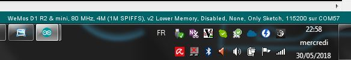

+++++++++++++++++++++++++++++++++++++++++++++++++++++++++++++++++
IOT Electrical Power Strip Software development documentation
+++++++++++++++++++++++++++++++++++++++++++++++++++++++++++++++++

.. contents:: Table of Contents
    :backlinks: top

.. toctree::
   :maxdepth: 2
   :caption: Contents
   :titlesonly:
   
   curentSensing

  
==============
Progression
==============
#. Affichage d'un page html static: ok
#. Affichage page html fichier SPIFFS : ok
#. Affichage de l'heure à partir d'une page en dur dans le code : ok
#. Affichage page avec CSS : ok
#. Gestion des mode wifi SoftAP vs client : ok
#. reception d'une action via un bouton :  ok
#. lecture du fichier de configuration : ok
#. intégration MCP23017 : ok
#. lecture du fichier de configuration config3.json : ok
#. gestion bouton poussoir mécanique : ok
#. Ecriture fichier json : ok
#. Traitement de la requete html avec analyze, exécution et écriture json: ok
#. manage wif led : ok
#. integrate nano expander with analog inputs : ok
#. scan I2C response 57 and 58 nano IoExpander !!!! not a bug simply DS3231 board has 2 component
   DS3231 an EEPROM ! OK
#. Time managment strategy : ok
#. review work without rtc component strategy ok
#. review work without NTP access strategy ok
#. define rtc component versus NTP update strategy ok
#. suppress html replies if main power is off ok
#. generate a unic server name  ok

#. Error handling improvment 95% (todo dislay low error with LED ? Wich one : power led ?)
#. configuration page (see softdev.rst)

#. power measurment

#. exhaustive test of hebdo mode : 95%
#. write index special page for softAP Mode with local boostrap or other light js.framework 5%
#. preparer un infographie résumant fonctionnalité et besoin : 
#. Write user manual : 1%
#. Write builder manual

Don't forget the todo list of the doxygen documentation

====================================
Namming convention
====================================

Référence : config4.json

====================================
To be added to config json file
====================================

To be added 30/30/2019
 - firstBoot ON/OFF                                                                         DONE
 - Power led behavior versus economy mode (include or exclude) ON/OFF  powerLedEconomyMode  DONE
 - change/separate wifi Station param and soft app                                          DONE
 - add wifiSoftApSsid, wifiSoftApPass SSid are in credentials                               DONE
 - for C code, if wifiSoftApSsid or wifiSoftApPass are empty : creatIt (see @firstBoot)     
 - startInApMode : ON/OFF                                                                   DONE
 - remove wifimode                                                                          DONE
 - change IP in softAP_IP and Port in softAP_port                                           DONE
 - change name of the file to config4.json                                                  DONE
 
To be added 09/05/2019
 - IP add in soft AP mode to display it (what the utility ? to configure it)                DONE
 - mac add to display it                                                                    DONE
 - add ip in mode Station : to configure it if we are not in DHCP mode                      DONE
 - DHCP_mode : On or OFF                                                                    DONE
 - gateway add                                                                              DONE

 To be added 9/7/2019:
  - time zone

====================================
Remember
====================================

#. see javascript http request to perform DELETE: obsolete

====================================
First boot configuration
==================================== 

@first boot :
 - mode AP connection and display config page to set SSID password and server name
 - softAP ssid <32
 - WARNING pass in AP mode >8 <63
 - propose a unic ID for server name to the user
 - explain that it will possible to change after
 

Restaure factory parameters 
=====================================
firstBoot after check box in config page.

Restaure defConfig.json
 
 
What are hypothesys, when boot for the first time ?
=====================================================
Is a config json exist ? What is inside it ? Yes and it containt FirstBoot ON and other stuff.

Same questions with credentials ? No, we generate it

We considere that the user upload sketch and data directory.

When consider the first boot is OFF ? When we receive the folowing form
 - station mode or AP choice
 - SSID et pass du mode AP (WARNING provide diff SSID if you own more then one PowerStrip)
 - SSID and pass of station mode [ optionel if user wish stay always in AP mode ]
 - propose default same hostname and default SSID AP build with mac add:
   IOT_EPS_HHHH

First boot process
=========================
#. check firstBoot param in config.json if ON
#. start in AP mode with page firstboot.html (in the code, not a real file) only if main power is on
#. server.on( /firstBoot, firstBootHandler)
#. in firstBootHandler check param, write credential, set firBoot param to "trySation" if needed
#. restart ESP
#. if Station is ok firstBoot is ended, set firstBoot param = off
#. if station ko reload firstboot page with alerte

Behavior when user move EPS from one physical site to another
===============================================================
It is not a first boot

EPS will search its WiFi station and will not find it so it restart in AP mode then user can acces
to the config special page change SSID and password.

===================================
Configuration parameter
===================================
 - add IP of AP mode
 - EPS name (host name)
 - Plugs names
 - Station SSID
 - Sation mode passwd
 - Soft AP SSID and password

All json general section parameter without:
 - numberOfPlugs
 - rtcValidity
 
set time in AP mode and perhaps for station mode summer and winter time.

As for plugonof, we decide to build one configuration page for station mode and one configuration
page for AP mode because in station mode we can use CDN( bootstrap and jquery) functionnality but 
not in AP mode because the embeded version of this `content delivery network (CDN)`_ are too 
big >3Mo.

Action name : cfgsend (all in lowercase)
Action name to get json value updated page : cfgpage

Set time and date parameter names
=====================================
setTime, setDate

.. index:: Modes

====================================
Plugs modes description
==================================== 

Manuel
======
- appui sur BP ON/OFF
- durée avant arrêt (durée limité à 300mn): pour s'offrir la possibilité de couper la prise en cas de départ prématurer...
- ou heure d'arrêt : dans le même état d'esprit mais pour fixer une heure absolue.

Timer / minuteur / mode cuit oeuf
==================================
- 1 seul paramètre la durée ON à partir de maintenant (durée limité à 300mn00s)
- 1 appui court lance ou relance la minuterie
- 1 appui sur BP (long) met OFF et repasse en manuelle
- la minuterie peut être avec des secondes exmple 2mn30s (2:30 dans la requête)

La minuterie est-elle uniquement lancée par BP ? Sinon comment on fait la diff
If state == On immediat start 

Périodique/cyclique
=====================
- duré on
- durée off 
- avec reprise de On après off indéfiniment jusqu'au repassage en commande manuelle.
- avec champ heure de début (et 'Entrez une heure de début (facultatif)' par défaut)
- un appui court sur BP met à OFF mais reste en mode cyclique pour le cycle suivant
- un deuxième appui court reprend le cycle (attention ne met pas forcément à ON)
- le mode pause de l'interface web effectue les mêmes actions que ci-dessus

- 1 appui sur BP (long) met OFF et repasse en manuelle

Hebdomadaire
==============
- heure de mise on
- heure de mise off
- choix des jours de la semaine
- un appui court sur BP met à OFF mais reste en mode Hebdomadaire pour le cycle suivant
- un deuxième appui court reprend le cycle (attention ne met pas forcément à ON)
- le mode pause de l'interface web effectue les mêmes actions que ci-dessus
- 1 appui sur BP (long) met OFF et repasse en manuelle

Clone
========
Clone le fonctionnement d'une des 3 autres prises. Il s'agit d'une copie des paramètres.
Ce n'est pas un clone dynamique. Ce qui signifie que l'information de la prise source et de
son état au moment du clonage ne sont pas historisés.

Evolutions possibles
=====================
- un mixte entre cyclique et hebo: clyclique mais seulement pendant un certaines 
  période de la journée.
- Sur le mode hebdo, prévoir la possibilité d'avoir plusieurs plage de fonctionnement par jours
  et différentes chaque jour
- connexion MQTT, IFTTT, Flic, openHAB

Factorisation des varibales de mode
=========================================

::

    redPlug
      State = ON
      Mode = Manuel | Minuterie | Cyclique | Hebdomadaire | Clone
      hDebut =
      hFin = 
      dureeOn = 60 en minutes
      dureeOff =  en minutes
      Jours[] s = OFF,OFF,OFF,OFF,OFF,OFF,OFF
      clonedPlug =
      onOffCount = 10  
  
=====================================
Start up behavior
=====================================

Question:what should be the behavior when power is switched to ON ?

2 cases are possibles when power is On: the button is switched to ON or the system restart after a
genaral power cut

Soit l'interrupteur général est actif (cas de la coupure EDF) et on reprend où on en était.

Soit l'interrupteur général est  inactif et on reprend en mode manuel.

L'interrupteur général coupe le 220V des prise mais pas de l'ESP8266.

Bien expliquer les 2 modes de fonctionnement dans l'interface WEB et donner le choix à l'utilisateur.

Expliquer le coup de la coupure de courant.

Evol : après coupure EDF : donner le choix à l'utilisateur de configurer le comportement de
chaque prise.

Possible behaviors:

 #. on repart d'où on en était (avec éventuellement alerte instantanée à l'utilisateur)
 #. on met tout la prise à OFF en manuel(avec éventuellement alerte instantanée à l'utilisateur)
 #. on informe l'utilisateur (canal à définir, MQTT ou autre...) qui décide mais on met en
    pause en attendant

When main power switch is off : html server post no reply.

Problem : when in AP mode WiFi start even if main power is OFF and in Station ESP connect to acces
point. It is not a logicaly expected behavior. When power switch is in OFF position no Wifi activity
should be detected.

Solution wait for power on in ARDUINO setup function.
Restart ESP in ARDUINO loop when power is switch to OFF.

.. index:: Special push buttons

Special push button behaviors @stratup
===========================================
PB0 : @power on (not by power switch but by wall plug) start in simple manual mode see `WIFI Modes`_

PB1 : in same conditions as above, start specials action only for expert and debug mode
(today creat default json) with main power switch on on state (to be cecked 21/10/2019) 

============================
Sofware development choice
============================
wifi access point

Les pages html sont dans le file système SPIFFS

Why do not use wifi manager ?
=========================================

=========================
Configuration ARDUINO
=========================

WEMOS D1 MIN ARDUINO configurattion:

.. index:: 
   single: Wifi modes

==================
WIFI Modes
==================

In Json config file, it is configured with: "startInAPMode" value,

No WiFi
==========
Also called simpleManualMode

When power on (by the wall plug not by the power switch) the powerStrip, maintain Push button plug 1

Power strip start in this mode independently of Json configured mode.

4 Big color LED flasf 20 times in purple.

In this very simple poor mode, powerstrip works only in manual mode with BP actions ON/OFF.

SoftAP
=========
EPS starts in this mode when value of "startInAPMode" parameter is "ON".

No acces to NTP server but all other functions work.

After 20 false tries of station mode, power Strip automaticly switch in this mode

Station
=========
EPS starts in this mode when value of "startInAPMode" parameter is "OFF".

The best functionnal mode ! With full web interface and others functions.

both mode STA and AP
=======================
July 2019 : reflexion when we start in DHCP station mode whe don't know IP address of the IoT EPS.
One way to know it is to use a tool to scan the local network !
So why do not connect systematically in both mode !!!
Do it in new dev branch  !!!!!!!!!!!!!!!!!! 10 months of development to arrive at this point !!!!

====================================
IP address
====================================
AP and non DHCP IP address are class C address (subnet mask is 255.255.255.0 hardcoded )

==================
WIFI LED behavior
==================
In Station mode, fast flashing (20 times 100ms, 100ms) before to try connection
and after slow flashing while waiting for connection.
(500ms with a 20 times time out - new in 24/12/2018). If no connection detected afte 20 tries
Automaticaly switch in SoftAP mode.

In Access Point LED FLash quickly (20 times 100ms-500ms) and 
led flash slowly (50ms-2s) while waiting for connection.

Cause WiFi.softAPConfig function is a blocking function. This is wrong : 
test on 24/12/2018 softAP is non blocking !

So - in summary - if power led is on and WIFI Led flash (50ms-2s) WIFI wait for connection in AP mode. 

It rises a new problem : in this state it is not possible to use plugs even in simple  manual mode 
with push button. 

Possible solution : check push button at startup if a particular combination is pressed,
plugs do not try to connect to wifi and mork in simple manual mode.
In Dec 2018, push button
added pressing plug 0 while power on the strip cause no WIFI mode (color LED FLASH in RED to confirm)
This is : simpleManualMode (see above). To return to normal mode power off the strip 
(not by the power on/off button but by removing the strip from the wall plug)

===========================================
ESP8266 and its wifi managment !
===========================================
ESP8266 store credentials information in FLASH but how to acces to them ???
And how to contol them

Question how to erase wifi flash param ?

Memory mapping is not provided. Somem peace of informations
like in SPIFFS des cription that provide the order of memory big blocks but not their respective add

Second question : how to directly acces to flash memory ?
Perthaps with SPI lib
https://github.com/esp8266/Arduino/blob/master/doc/libraries.rst#spi
Reponse :
ESP.flashRead(...)https://github.com/esp8266/Arduino/blob/master/cores/esp8266/Esp.h
ESP.flashWrite(..)
ESP.flashEraseSector(...)
ESP.eraseConfig() Efface tout à partir du haut de la flash jusqu'en -0x4000 soit 16k
Fonction non documentée !

ESP-SDK ? Rien vu qui permet erase

persistant(false) <=> n'écrit pas en flash mais n'efface pas les info

Question 3: How to read  flash info  ?
Reponse : call Espressif SDK functions:
#include <user_interface.h> in
Arduino\Croquis\hardware\esp8266com\esp8266\tools\sdk\include
page 62/179 pdf ESP8266 Non-OS SDK API Reference 
3.5.33. wifi_softap_get_config_default

.. code::

    struct softap_config {
        uint8 ssid[32];
        uint8 password[64];
        uint8 ssid_len;	// Note: Recommend to set it according to your ssid
        uint8 channel;	// Note: support 1 ~ 13
        AUTH_MODE authmode;	// Note: Don't support AUTH_WEP in softAP mode.
        uint8 ssid_hidden;	// Note: default 0
        uint8 max_connection;	// Note: default 4, max 4
        uint16 beacon_interval;	// Note: support 100 ~ 60000 ms, default 100
    };

ESP12E module Flash size : W25Q32 32Mbits/4Mo 256octets /pages 16384 pages
Peuvent être effacé ar groupe de 16 ou 128 ou 256 Soit 4(secteurs) ou 32kB ou 64kB

====================================
Displaying plugs mode only with LED
====================================

Problem : how to displays functionnal mode of a plug without the web interface

Problem2 : is it really necessary ?

Solution1: Use the little plug red LED. When OFF flash 1 shortly one time for mode 1 manual to five
 time for mode 5 Clone. When ON invert ton and toff of the flasher

Solution2: use color LED with flash capability one time for mode manual to 5 times to mode Clone
with a long periode between group of flash 3 seconds for example.

Implemented solution : n°1 with the little specialPB pushed in the same time as the plug Push Button

Advice : retain special BP some seconds before pushing plug's PB to avoid to swith the plug.

===========================
WEB page development
===========================

HTML5 et css and bootstrap
jquery, jquery ui, ajax and popper

bootstrap from its CDN
https://www.bootstrapcdn.com/

html requests
=====================

ipaddr/config?plug=redPlug

/PlugConfig?plug=red&mode=manuel
/modeManuel?plug=redPlug

Utilisation de formulaires

Possible requests:

- Mode=Manuel&State=ON&dureeOff=299 : dureeOff on minutes only
- Mode=Manuel&State=ON&dureeOff=299:59 : dureeOff on minutes and seconds
- Mode=Manuel&State=ON&hFin=23:59 : hFin only one format HH:MM
- Mode=Manuel&State=OFF
- Mode=Manuel&State=ON

NTP server name
=================
The name reside in the IoT_EPS.h file and is not a config param through web config page

====================
Serveur html ESP8266
====================
Repris de l'exemple fourni avec l'IDE ARDUINO : ESP8266WebServer/FSBrowser

Cette exemple apporte un lot de fonction qui gérent l'envoie de fichier css, jpg et autres...

edit page
==============
Comportement etrange de l'extnsion html

Le bouton parcourir tronc en htm et le visualisateur ne montre que les fichier htm

Edit.htm source code ? not provided in the .ino file

One possible source (but not really the same) :
https://github.com/gmag11/FSBrowser/blob/master/data/edit.html

==============
IOExpander
==============

The following text is for history only and it is obsolète:

When we define hardware pin usage, we decide to use IOEpander MPC23017.
Due to this choice=, we need to use a new lib Adafruit_MCP23017.h

Available method:

.. code::

    void begin(uint8_t addr);
    void begin(void);

    void pinMode(uint8_t p, uint8_t d); // 0<= p < 16
    void digitalWrite(uint8_t p, uint8_t d);
    void pullUp(uint8_t p, uint8_t d);
    uint8_t digitalRead(uint8_t p);

    void writeGPIOAB(uint16_t); /: A priori on peut écrire sur un  port en entrée sans risque
    uint16_t readGPIOAB();
    uint8_t readGPIO(uint8_t b); // b=0 => PORTA, else PORTB

    void setupInterrupts(uint8_t mirroring, uint8_t open, uint8_t polarity);
    void setupInterruptPin(uint8_t p, uint8_t mode);
    uint8_t getLastInterruptPin();
    uint8_t getLastInterruptPinValue();
  
Adresse par défaut: 0x20 (avec les 3 broches d'adresse à 0)

En premier mouture, essai avec la librairie directement mais en deuxième monte, faire une classe
qui prennent en charge la gestion du temps (classe Flasher dédiée au MCP)

Deuxième mouture clréation de la class CPowerPlug avec utilisation de variable static

_initDone et _mpc (mpc étant la ressource commune à toutes les instances de la classe)

.. important::

    J'ai choisi d'utiliser une broche dédiée pour la LED d'état des plugs.
    On aurait pu utiliser la broche de commande du relais mais au cas où les 2
    seraient inversées l'une par rapport à l'autre, cela apporte plus de liberté.

During development, to get more digital IO and 4 analog input, we decide to add a ARDUINO Nano as 
an I2C IO expander (see Hardware dev doc)

    
==================================
Error handling
==================================

See dedicated Excel file. All below informations are obsoletes.

Buildin test error BIT

PBIT : preliminary BIT

#. File system
#. Config param (JSON config file)
#. Credentials file (not in firstboot mode) - check its structure
#. I2C acces
#. rtc
#. only in Station mode and after WIFI connection, check NTP access

CBIT : Continus BIT every loop cycle, check :
 - I2C acces (only one retry)
 - RTC access
 - JSON config file
 - File system 
 - NTP access
 
...

 - current monitoring for ON plugs and if it is possible with the choosen sensor when currents will 
   be very low

Not in CBIT
 - WIFI state if in Station mode and/or AP mode ???
 
Because when wifi is down (wifi box shut down for exemple EPS could continue to work)

Can we work without File system or Json error ? No, fatal error => RED LED FLash 
 The system won't be started so no special web page index

Can we work without credential file ? Yes start in AP mode : OK

Check credentials.json structure

Can we work without I2C and/or nanoI2CIOExpander ? No, fatal error : OK

Can we work without RTC ? No, in the first release of IoT_EPS we consider that when one component
is ko the entire EPS is ko (no degraded mode). 

Perhaps in future version of the EPS, we can imagine that we work without DS3231 and only with
NTP server and the ARDUINO Time.h. This version of the EPS could only work in Station mode.

Can we work without internet connection or Wifi in station mode ?
 yes in softAP mode Refine softAP mode behavior
 
 Can we work without NTP server ? Yes (it could be temporary down)
 
.. important::
 
    How to display no fatal error ? the only one is NTP error all other error are FATAL
    We decide to only display on index html page

================================
Time managment strategy
================================

Normal

No NTP server (no Wifi)

First of all, what is the time usage in the EPS ? bool CPowerPlug::isItTimeToSwitch() =>
CRtc::now().unixtime() <=>  DS3231::now().unixtime()

if NTP is reachable ie in Station mode and all is ok update DS3231 time every 15mn.
else do not update ds3231 and work with its time !

if NTP not reachable or in AP Mode the time can be updated by configuration page.

NTP server configuration ? not configurable for now only in IoT_EPS.hDebut

RTC on error strategy, No RTC component

================================
RTC DS3231 EEPROM access
================================
nano ADD is 58

I2C add of EEPROM AT24C32 is 57
Changed to 0x53

Ok but why access to this EEPROM ? 
Perhaps to store a copy of config3.json

Live time ? 10^6 write cycle

8 bytes/page 4ko

===================================
Livetime of ESP8266 flash SPIFFS
===================================
hypothesis :
- 4 plugs that work in clycle mode 1 minutes on and 1 minutes off
- 4 plugs not synchronyzed
With this hyp. the 4write/minutes 

WEMOS D1 Flash is Ai ESP12-F module W25Q32 pour 32Mbits soit 4Mo
100k erase/write cycle

25k minutes = 416 hours = 17 days

But it is a very hard hypothesis

A great question : what is the realistic usage ?

- one On/off cycle by hour on each plug every days only 12 hours by days
  25k hours /12 <=> 2083 days <=> more than 5 years
 
====================================
 Livetime of the relays
====================================
 10^7 time 

================================
HTML IHM integration
================================
Start on March 2019

Used technologies:

- HTML5/css
- Javascipt
- JQuery
- Boostrap

Test list:

For all plugs

- manual ON/OFF :  OK on RED
- manual ON with OFF time : ok on RED
- manual ON with delay : ok on RED 1 minutes
- timer : RED plug ko, state no transmit: corrected ok
- timer red switched by bp : OK
- clone from green cyclic to bleu : ok

... see testAndErrorHandling.xlsx file for the rest of the tests

bug finded :
- manual hfin and dureeOff without parameter should be KO
- manual cleanup buton dont remove hfin and others param
- no default state in manual mode : corrected
- minuterie (timer mode) no default value for the ratio immediat start or differed start - corrected
- bug in ESP source side effect of main power switch  ?

improvments:
- add tips on main page : To refresh this page press F5

===============================
Usefull Tools
===============================

On Android : `Network IP Scanner`_ from homework.

On PC : `Angry IP Scanner`_

.. _`Network IP Scanner` : https://play.google.com/store/apps/details?id=com.network.networkip&hl=fr
.. _`Angry IP Scanner` : https://angryip.org/
    
===============================
Usefull Documentation
===============================

Html server
=====================

Exemples ESP html serveurs:

C:\MountWD\Donnees\OneDrive\Donnees\008_iao_wrk\Arduino\Croquis\ESP01\HelloServer

Documentation `arduino-esp8266`_

.. _`arduino-esp8266` : https://arduino-esp8266.readthedocs.io/en/latest/esp8266wifi/readme.html#class-description

Gros gros tuto sur  `Web serveur`_ 

.. _`Web serveur` : https://github.com/projetsdiy/ESP8266-Webserver-Tutorials

Demonstrate using an http server and an HTML form to `control an LED`_. The http server runs on the ESP8266. 

.. _`control an LED` : https://gist.github.com/bbx10/5a2885a700f30af75fc5

jQery slim : 70ko

fastLed
=============

`FastLed lib`_

.. _`FastLed lib` : https://gi thub.com/FastLED/FastLED

json (lectures / écritures)
==============================

La librairie utilisée: `ArduinoJson`_ version 5.13.2 

.. _`ArduinoJson` : https://github.com/bblanchon/ArduinoJson

Assistant plutôt efficace: `ArduinoJson Assistant`_

.. _`ArduinoJson Assistant` : https://arduinojson.org/v5/assistant/

Json genrator sur `ObjGen.com`_

.. _`ObjGen.com` : http://www.objgen.com/json

========================
Used library
========================
last update : 02/12/2018

10 libs:

- Utilisation de la bibliothèque ESP8266WiFi version 1.0 
- Utilisation de la bibliothèque ESP8266WebServer version 1.0 
- Utilisation de la bibliothèque ArduinoJson version 5.13.2
- Utilisation de la bibliothèque Wire version 1.0 
- Utilisation de la bibliothèque RTClib version 1.2.0
- Utilisation de la bibliothèque ESP8266mDNS prise
- Utilisation de la bibliothèque Adafruit_MCP23017_Arduino_Library version 1.0.3 
- Utilisation de la bibliothèque FastLED version 3.2.1 
- Utilisation de la bibliothèque nanoI2CIOExpLib version 3.1
- Utilisation de la bibliothèque NTPClient version 3.1.0

9 libs are official Arduino libs and one lib is spéciale:

`nanoI2CIOExpLib`_
 
.. _`nanoI2CIOExpLib` : https://www.hackster.io/MajorLeeDuVoLAB/nano-i2c-io-expander-3e76fc

===============================
Eccueils et autres difficultés
===============================

Limite des longueurs de nom de fichier SPIFFS
===============================================

Les noms de fichiers dans SPIFFS sont limités par défaut à 32 caractères chemin compris.

C'est court! voir `github issue #34 mkspiffs`_

.. _`github issue #34 mkspiffs` : https://github.com/igrr/mkspiffs/issues/34

Prise en main de la librairie JSON
======================================

Nécessite un investissement personnel important.

DS3231 stuck I2C bus
======================

It is a known problem with DS3231 see `method for recovering I2C bus #1025`_

.. _`method for recovering I2C bus #1025` : https://github.com/esp8266/Arduino/issues/1025

and `Reliable Startup for I2C Battery Backed RTC`_

.. _`Reliable Startup for I2C Battery Backed RTC` : http://www.forward.com.au/pfod/ArduinoProgramming/I2C_ClearBus/index.html

=============================
Source code documentation
=============================
 
 `<codeDoc\\html\\index.html>`_

===========================
Vocabulary
===========================

Un réseau de diffusion de contenu (RDC) ou en anglais `content delivery network (CDN)`_

.. _`content delivery network (CDN)` : https://en.wikipedia.org/wiki/Content_delivery_network

=============
Webography
=============

.. target-notes::

