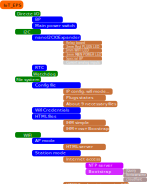
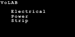
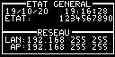

+++++++++++++++++++++++++++++++++++++++++++++++++++++++++++++++++
Software development documentation
+++++++++++++++++++++++++++++++++++++++++++++++++++++++++++++++++

.. toctree::
   :maxdepth: 2
   :caption: Others related pages
   :titlesonly:

   firstboot
   plugmodes
   configAndParam
   wifiwebinternet   
   curentSensing
   variable

.. contents:: Table of Contents
    :backlinks: top

.. |clearer|  raw:: html

    

=============================
Source code documentation
=============================

Source code documentation provide a lot of informations
 
 `<codeDoc\\html\\index.html>`_

====================================================================================================
Software architecture or how does it work
====================================================================================================
Some words on software architecture @13/07/2020

see also `Json file improvements : analyze`_

Major points
====================================================================================================

One main .ino file with its .h : IoT_EPS.
In the header file we can find include and config informations. (to be changed - 
:ref:`see project todo list<todocreateconfigfile>` ) 

A lot of usage of global variables and objects (not very optimal). :ref:`See variables list<refVariableList>`

Usage of one big json file (except for credentials) to store plugs information and 
application parameters. Not optimal (a better choice would be one file for general informations and
one file for flugs parameters and perhaps one file by plug).

Usage of static functions in some object like Crtc du to usage of external library.

Usage of a pseudo object in SerialCommand (just a struct) due to reuse of code from an other project.

The embedded html server is based on ESP8266webserver class 

Global File system SPIFFS is based on ESP8266 core

Operations
====================================================================================================
An array of 4 plugs object manage the behavior of the plug. Events from wifi trigs 
web server functions. The main part of the jobs is to write data in the json file that it is resend
to the user's navigator.

Timing are managed by CRtc a derived class from rtc from RTClib.

The wifi : after a long expectation where I navigate between station mode or softAP mode. Finally,
i activate the 2 modes simultaneously.

====================================================================================================
How does it work
====================================================================================================
There is 2 worlds

The Plugs world and the Web world.

The Plug world
====================================================================================================
It is although the hardware or physical world

**Setup sequence**

- serial, time, ftp, debug oled screen init
- Watchdog check
- Main power first check (already on ? Return from electrical power down, hot restart)
- Plugs config
- Main power wait ON (the purpose is to maintain Wifi off) loop
- WIFI start
- Server configurations
- Time server check 
- Setup last operations (displayCommandsList, initCBITTimer, check internet access and setup wd)

**Loop sequence**

- CBIT : Continus Built In Test Start : periodicly check file system, internet access
- watchdog refresh
- Some little jobs : specialBp, ftp, SerialProcess...
- manage leds
- manage bps + plugs time to switch  
- main power switch actions

The Web world
====================================================================================================
Server event (HTTP GET requests). They are mapped to callback C functions (CServerWeb methods)

============== ===================================================================================
Event          Binded functions
============== ===================================================================================
 /             firstBootHtmlForm, handleSoftAPIndex or handleIndex
 /time         displayTime
 /list         handleFileList
 /plugonoff    handlePlugOnOff
 /help         handleHelp
 /edit         handleEdit, handleFileCreate, htmlOkResponse, handleFileUpload, handleFileDelete
 /cfgpage      handelIOTESPConfPage
 /cfgsend      handleIOTESPConfiguration
 /changeCred   handleNewCred
 /firstBoot    handleFirstBoot
============== ===================================================================================

Theses events are triggered by HTTP requests from user's Web browser. Some of these above request are
not implemented in http pages and are only for debug and should be send directly in the uri like 
``/time``

Html pages are stored in the data folder of the SPIFFS in the ESP8266 flash.

Links between the 2 worlds
====================================================================================================
These 2 worlds live their lives almost independent of each other.

There are 2 links between them:

- the json file
- the time

Events write data in json file and physical part of the system check periodicaly the data in the 
json file and do the jobs.

.. _devProgress:

===========================
Progress of development
===========================

Terminated
==============================

::

    #. Display single static html page:                                                      ok
    #. Affichage page html fichier SPIFFS :                                                  ok
    #. Affichage de l'heure à partir d'une page en dur dans le code :                        ok
    #. Affichage page avec CSS :                                                             ok
    #. Gestion des mode wifi SoftAP vs client :                                              ok
    #. reception d'une action via un bouton :                                                ok
    #. lecture du fichier de configuration :                                                 ok
    #. intégration MCP23017 :                                                                ok
    #. lecture du fichier de configuration config3.json :                                    ok
    #. gestion bouton poussoir mécanique :                                                   ok
    #. Write json file :                                                                     ok
    #. Traitement de la requête html avec analyze, exécution et écriture json:               ok
    #. manage wif led :                                                                      ok
    #. integrate nano expander with analog inputs :                                          ok
    #. scan I2C response 57 and 58 nano IoExpander !!!! not a bug simply DS3231 board has 2 component DS3231 an EEPROM ! OK
    #. Time managment strategy :                                                             ok
    #. review work without rtc component strategy                                            ok
    #. review work without NTP access strategy                                               ok
    #. define rtc component versus NTP update strategy                                       ok
    #. suppress html replies if main power is off                                            ok
    #. generate a unique server name                                                         ok
    #. rewrite main program setup and loop function with more object oriented structure      ok
    #. add OLED display managment in accordance of its hardware implementation of course     ok

In progress
======================

#. creation of config.h and config-advenced.h (see :ref:`see project todo list<todocreateconfigfile>`) 
#. Correct watdog bug
#. improve json file managment **2 points need work**
    - write process
        - test **ok**
            - environnement conda test **ok**
            - write python script to log boot sequence to a file: in progress ``projet\_3_software\outilPythonSpecial`` **ok**
            - record some boot sequence **ok**
            - check boots sequence **ok**
    - treat todo (error rise)
        - regen list
        - treat one by one
    - clean the code
    - comit **ok**
    - push **ok**
    - merge **ok**
    - push **ok**
#. Minifier all files if possible of course and reduce the size of the images
    - minifier picture
    - minifier css
    - minifier html
#. Error handling improvement 95% (todo display low error with LED ? Which one : power led ?)
#. configuration page (see softdev.rst)
#. exhaustive test of hebdo mode : 95%
#. write index special page for softAP Mode with local boostrap or other light js.framework 5%
#. Create an infographic that summarize features and needs 
    - choose tool
    - choose Size
    - choose colors
#. Write user manual : 1%
#. Write builder manual
    - mechanical parts
    - buy and groups components
    - oder pcb

#. UML and classes documentation 10% - web and json

Don't forget the todo list of the **doxygen documentation** and **git history**:

    - before regen todo list

Differed to next version
====================================================================================================

::

    #. power measurement - not in this vesion

====================================================================================================
Config.h and config_advenced.h
====================================================================================================
config.h include all user define macro.

config_advenced.h group all others interesting parameters

====================================================================================================
Watchdog bug 
====================================================================================================
There is no  watchdog component in the system and system always displays watchdog ok !!!

Detection date :5/12/2021

Start of traitement : 08/12/2021

Dev branch : watch_dog_bug :

Code analyze::

    Method : void CSysStatus::display() do not display wd error ! Why ! An oversight ?
    This method display **9 errors**

    But the class CSysStatus() is declared with **11 error** !

    CSysStatus::isSystemok()

    CSysStatus::howManyError()

    String CSysStatus::getMsg( int8_t n)

In the setup sequence::

    <Volab setUp > watchdog test 
    <Volab System error handler > watchdog error
    <Volab setUp > watchdog set to 30s.

Creation of ``config.h`` et de ``config_advenced.h`` **OK**

define : ``#define NBR_OF_SYSTEM_ERROR 11`` in ``config_advenced.h``

The purpose of this is to create a table of system error in the class.

====================================================================================================
More object oriented rewriting (August 2020)
====================================================================================================

see in :ref:`variable list<refVariableList>`

.. index::
    single: Naming

====================================
Naming convention
====================================

Référence : config4.json

====================================
Remember
====================================

#. see javascript http request to perform DELETE: obsolete

Référence : config4.json (this is the only file name that is mandatory to ensure interface between 
plugs and wed worlds).

In the code I use lower Camel Case.

============================
Software development choice
============================
wifi access point

Html pages are in the file system SPIFFS

Why do not use wifi manager ?
=========================================
A good question and i have no answers today !

======================================
Displaying plugs mode only with LEDs
======================================

Problem : how to displays functional mode of a plug without the web interface

Solution1: Use the little plug red LED. When the LED is OFF flash shortly one time for mode 1 "manual" to five
time for mode 5 "Clone". When ON is on invert ton and toff of the flasher

Solution2: use color LED with flash capability one time for mode manual to 5 times to mode Clone
with a long time between group of flash 3 seconds for example.

Implemented : solution n°1 with the little specialPB pushed in the same time as the plug Push Button

**An advice for users** : retain special BP pressed some seconds before pushing plug's PB to avoid to swith the plug.

==============
IOExpander
==============

The following text is for history only and is **obsolete**:

When we define hardware pin usage, we decide to use IOEpander MPC23017.
Due to this choice, we need to use a new lib Adafruit_MCP23017.h

Available method:

.. code::

    void begin(uint8_t addr);
    void begin(void);

    void pinMode(uint8_t p, uint8_t d); // 0<= p < 16
    void digitalWrite(uint8_t p, uint8_t d);
    void pullUp(uint8_t p, uint8_t d);
    uint8_t digitalRead(uint8_t p);

    void writeGPIOAB(uint16_t); /: A priori on peut écrire sur un  port en entrée sans risque
    uint16_t readGPIOAB();
    uint8_t readGPIO(uint8_t b); // b=0 => PORTA, else PORTB

    void setupInterrupts(uint8_t mirroring, uint8_t open, uint8_t polarity);
    void setupInterruptPin(uint8_t p, uint8_t mode);
    uint8_t getLastInterruptPin();
    uint8_t getLastInterruptPinValue();
  
Default address: 0x20 (with the 3 address pins at ground)

En premier mouture, essai avec la librairie directement mais en deuxième monte, faire une classe
qui prennent en charge la gestion du temps (classe Flasher dédiée au MCP)

Deuxième mouture création de la class CPowerPlug avec utilisation de variable static

_initDone et _mpc (mpc étant la ressource commune à toutes les instances de la classe)

.. important::

    J'ai choisi d'utiliser une broche dédiée pour la LED d'état des plugs.
    On aurait pu utiliser la broche de commande du relais mais au cas où les 2
    seraient inversées l'une par rapport à l'autre, cela apporte plus de liberté.

During development, to get more digital IO and 4 analog inputs, we decide to add an ARDUINO Nano as 
an I2C IO expander (see :ref:`Hardware dev doc<nanoI2CIoExpander>` ) 

.. index::
    single: Error handling

==================================
Error handling
==================================

   
   IoT_EPS ressources tree

**All below informations are obsoletes.** See dedicated Excel file ``testAndErrorHandling.xlsx`` under
``_1-1_tests`` subdirectory.

Buildin test error BIT

PBIT : preliminary BIT

#. File system
#. Config param (JSON config file)
#. Credentials file (not in firstboot mode) - check its structure
#. I2C access
#. rtc
#. only in Station mode and after WIFI connection, check NTP access

CBIT : Continus BIT every loop cycle, check :
 - I2C access (only one retry)
 - RTC access
 - JSON config file
 - File system 
 - NTP access
 
...

 - current monitoring for ON plugs and if it is possible with the choosen sensor when currents will 
   be very low

Not in CBIT
 - WIFI state if in Station mode and/or AP mode ???
 
Because when wifi is down ( if our wifi box shutdown, for example, EPS should continue to work)

Can we work without File system or Json error ? No, fatal error => RED LED FLash 
 The system won't be started so no special web page index

Can we work without credential file ? Yes start in AP mode : OK

Check credentials.json structure

Can we work without I2C and/or nanoI2CIOExpander ? No, fatal error : OK

Can we work without RTC ? No, in the first release of IoT_EPS we consider that when one component
is ko the entire EPS is ko (no degraded mode). 

Perhaps in future version of the EPS, we can imagine that we work without DS3231 and only with
NTP server and the ARDUINO Time.h. This version of the EPS could only work in Station mode.

Can we work without internet connection or Wifi in station mode ?
 yes in softAP mode Refine softAP mode behavior
 
 Can we work without NTP server ? Yes (it could be temporary down)
 
.. important::
 
    How to display no fatal error ? the only one is NTP error all other error are FATAL
    We decide to only display on index html page

.. index::
    single: Time managment

================================
Time managment strategy
================================

Normal

No NTP server (no Wifi)

First of all, what is the time usage in the EPS ? bool CPowerPlug::isItTimeToSwitch() =>
CRtc::now().unixtime() <=>  DS3231::now().unixtime()

if NTP is reachable ie in Station mode and all is ok update DS3231 time every 15mn.
else do not update ds3231 and work with its time !

if NTP not reachable or in AP Mode the time can be updated by configuration page.

NTP server configuration ? not configurable for now only in IoT_EPS.h

RTC on error strategy, No RTC component

====================================================================================================
I2C address
====================================================================================================
- watchdog : 0x26 (defined in cattiny_i2C_watchdog.h)
- OLED 0x3C
- EEPROM on DS3231 1010011 normaly 0x53 base add is 0x50 and I have solder A2 slot
- ioexpender : 0x58 (ored with D13) - defined in the ARDUINO NANO code
- DS3231 : 0x68 defined in RTClib.h

There is 3 pull-up on the board.

<F> command result (22/06/2021)::

    I2C device found at address 0x26  !
    I2C device found at address 0x3C  !
    I2C device found at address 0x53  !
    I2C device found at address 0x58  !
    I2C device found at address 0x68  !
    

================================
RTC DS3231 EEPROM access
================================
nano ADD is 58

I2C add of EEPROM AT24C32 is 57
Changed to 0x53

Ok but why access to this EEPROM ? 
Perhaps to store a copy of config3.json

Live time2 ? 10^6 write cycle

8 bytes/page 4ko

.. index::
    single: Lives times

====================================================================================================
OLED Screen integration
====================================================================================================
0.96" `128X64 I2C SSD1306 on Aliexpress`_

.. _`128X64 I2C SSD1306 on Aliexpress` : https://fr.aliexpress.com/item/33008480580.html?spm=a2g0o.cart.0.0.5d273c007sJ7KR&mp=1

`Adafruit GFX library`_  used 

.. _`Adafruit GFX library` : https://learn.adafruit.com/adafruit-gfx-graphics-library

Add I2C 0x78 on the board (7 or 8 bits add ?)

The right add is 0x3C

There is a pdf documentation for the GFX lib but no doc for special method in SSD1306.

setTextSize : ???

1 is default 6x8, 2 is 12x16, 3 is 18x24, etc (in adafruit source code)

Size 1 : 8 lign of 21 char
Size 2 : 4 lign of 10 char
Size 3 : 2 lign of 5 char

Screen definitions
====================================================================================================
Screen are created with GIMP and converted with `LCD Assistant from radzio.dxp.pl`_

.. _`LCD Assistant from radzio.dxp.pl` : http://en.radzio.dxp.pl/bitmap_converter/

Screen color shall be inverted in GIMP text shall be in black and screen in white.
 
Bitmap exported file from GIMP shall be in 2 bits indexed color maode
(In gimp: Image/Mode/Couleur indexée... menu and dialog box)

How many and what screen do we need ?

First screen VoLAB logo

Second screen : The project name : 

First and second screen are display by CSystem::_oledStartMessagesManager

In the septup sequence::

  - DS3231 demarre a: ( CSystem.init() )    [on line 1]
  - A partir d'ici:                         [on line 3]
  - * I2C ok                                [on line 4]
  - * Fichiers ok
  - * Parametres ok

In the loop sequence:

To display IPs, states and errors. Exemple: time server and Wifi accessibility... 

On the above screen, only Date, time and state can change. Ip adress stay the same to the next reboot !

So the right place to put it it at the end of setup loop.

I place methods in the CSystem class not very logic. The right way to do it should be to creat a new
dedicate dislayMessageClass.

====================================================================================================
Json file improvements : analyze
====================================================================================================
Simple improvements
====================================================================================================
05/07/2021:

CPowerPlug::readFromJson() : move up configFile.close(); at l253 to l189

readFromJson twice defined. Ontime in CPowerPlug and on time in ConfigParam: not the same method. 
One for Plug parameters and one for general parameter

ConfigParam::readFromJsonParam() : move up configFile.close() Too

CpowerPlug::on, off toggle, updateOutputs could be private

JSON structure
====================================================================================================
.. uml:: graphviz/config4json.wsd

JSON structure vs variables
====================================================================================================
.. uml:: graphviz/config4jsonVsVariables.wsd

Lines in green tag differences between json and class members.

emplacement, startInAPMode and ntpError exist in json but not in the ConfigParam class.

_wifiMode exists in ConfigParam class but not in json

In the same maner for plug structures:

hDebut, hFin, dureeOn, dureeOff, clonePlug and onOffCount are in json but not in the class.

22/07/2021: creation of the members of ConfigParam:

- _emplacement
- _startInApMode
- ``_clé à créer 1_`` : becomes wifimode in config4.json

About ntpError json parameter:

- write in the loop at line 396 in cbit.

- and write in CSystem::timeServerCheck

but what is its usage ??? in the system ?

.. WARNING::

    Don't confuse String CPowerPlug::_plugName and nickName

On power plug class side, creation of new members:

String nickName, hDebut, hFin, dureeOn, dureeOff, clonedPlug, onOffCount.

Write to file improvements
====================================================================================================
**First question**: track all json config file access by tracking all usage of CONFIGFILENAME

See GraphViz diagram : IoTEps config4.json access

.. graphviz:: graphviz/config4Access.gv

Conclusion there are 2 places that write to json file : in ConfigParam Class for configuration
parameters and in Cpowerplug class for plugs parameters.

There are 6 methods that write to json file:

- "CPowerPlug::handleBpLongClic()"
- "CPowerPlug::writeToJson(p,v)"
- "ConfigParam::write2Json()"
- "ConfigParam::creatDefaultJson()"
- "CPowerPlug::writeDaysToJson()"
- "CServerWeb::handelIOTESPConfPage()"

**Second question**: after track all usage of write to json methods

**third question**: what are the events that trig writes on json file ?

handleBpLongClic
====================================================================================================
This method is used 3 times in the ino file. One time in the setup and 2 times in the loop.
The purpose of this function is to force plugs modes to manual. After power off switching or
after a long press on the plug's button

.. graphviz:: graphviz/handleBpLongClic.gv

CPowerPlug::writeToJson(p,v) and writeDaysToJson
====================================================================================================

.. graphviz:: graphviz/CPowerPlugWrites.gv

The second one could be a private method

From configParam classe
====================================================================================================
In configParam class there is only 2 methods that directly write to config4.json file.

- writeTOJson( p,v,f ) : the MAIN function
- creatDefaultJson() : to restaure a fresh file when corrupted

Write to json events
====================================================================================================

.. uml:: graphviz/writeEventsGlobal.wsd

----------------------------------------------------------------------------------------------------

.. uml:: graphviz/wrtiteEventsWebdetails.wsd

----------------------------------------------------------------------------------------------------

.. uml:: graphviz/writeEventsTimeToSwitch.wsd

----------------------------------------------------------------------------------------------------

.. uml:: graphviz/writeEventsWebPlugOnOff.wsd

====================================================================================================
JSON improvements : rewriting stage
====================================================================================================

On git branch : json_new : terminated on 2021 november

Strategy : **obsolete** see REX Reflections
====================================================================================================

One json master file : config4.json (no change) and now we introduce 2 copies

Throughout operation, Json data **reside** in RAM : this is the **most important change**.

On web and plug events, write2json methods do not write directly to the file, they change data in RAM
and after all changes, file is store in SPIFFS and 2 copies are made with hash verification.

At startup, hash of the 3 files are checked to determine what file is good and what file is corrupted.
After this check, the good file is loaded or none if all 3 files are corrupted. In this situation a
new system error is risen.

See the figures below.

.. uml:: graphviz/jsonNewStrategyStore.wsd

.. WARNING::

    Pb: in the write procedure, if power is shut down just after first json write, the master file 
    is good but the file has a different hash value of copy1 and copy2

    Pb2: if power is shut down just after the write of copy 1, 3 hash values are different but
    master is good !
    
    To solve this possible bug we decide to had a special field in the json file to check the 
    readability of the data in the file (jsonTag and jsonVersion).

As we can't compute hash directly on the file but only with data in RAM, the file store strategy 
presented here is not feasible.

So finally we made 3 stores, check the 3 hash values if there are not same we retry 3 times. After 
3 tries, we rise a fatal error.

**REX reflections**::

    With json files, we can't compute checksum, crc or hash value and put it directly in the last octets 
    of the file as it is made with binary config files.

    We need json for direct send by the html server to the web browser client.

    To day we don't have a lib to compute the hash value directly on the SPIFFS file and even if we find
    one where to store the value ? In an other file ? In this case it creates a new pb if power is shut down
    just between the 2 writes. No luck !

    An other reflection where errors came from ? at the write time or at the read time ? We suppose at the 
    write time, just after the function open as write of the file and power is shut down before the real
    write process.

    The technique of the hash in 3 files is not enough robust. Example: if a write error arrives just 
    at the second write, we have 3 different hashes and we can't conclude. In the same way, we have an 
    error on the first write, a right write on the second and just after a power shut down, here we have
    3 different hashes values.

    To correct this we had some tags in the file, so if we put a tag at the beginning of the file and one
    at the end, if this 2 tags are good there is great chances that file is correct.

    Finally we decide to write only 2 files and keep the third as a template to restaure a default
    situation if the 2 others files are corrupts. This Third file is only writes when the user 
    change the configuration.

    An other way, would be to store hash value somewhere in a file or in the nano eeprom and in the 
    load process we keep the first couple hash,file that is correct !

----------------------------------------------------------------------------------------------------

|clearer|

.. uml:: graphviz/jsonNewStrategyLoad.wsd
    :align: center

|clearer|

Json data in RAM
====================================================================================================

How to create ? A check at `ArduinoJson documentation`_

Static or Dynamic json Document ?

::

    The memory of theJsonDocumentcan be either in the stack or in the heap. The location depends on the 
    derived class you choose. If you use a StaticJsonDocument, it will be in the stack; if you use a
    DynamicJsonDocument, it will be in the heap

.. _`ArduinoJson documentation` : https://arduinojson.org/v6/doc/

From my reads, the technique is to keep a simple strucutre in RAM and to creat the json object at
write or load time. Not to keep the json object throughout operations.

It is not a good idea to keep Json object in memory see `Arduinojsondoc Why is it wrong to reuse a JsonDocument?`_

.. _`Arduinojsondoc Why is it wrong to reuse a JsonDocument?` : https://arduinojson.org/v6/how-to/reuse-a-json-document/

.. warning::

    More : data are already in ram : in configParam and in plugs[] instances !
    
    The new class needs only 2 pointers to acces to this data.

Modifications
====================================================================================================

Class CJsonIotEps created. Instance jsonData in .ino file created.

**Question**: new instance in .ino or in class CSystem ?

@startup stage : how load the json into ConfigParam and in the plugs ? All the above graphics 
don't answer to this question !!!!!

sysIoteps.init -> ConfigParam.begin -> ConfigParam.readFromJson

.ino (setup)::

    if ( mainPowerSwitchState ) sysStatus.plugParamErr.err( !plugs[i].readFromJson( true ) );

This line restaure plug parameters

**Answer**: new instance in the .ino file

**Question**: who need to call new class ? CSystem, ConfigParam, CPowerPlug ?

In others words, who init with what ? New class with a pointer to ConfigParam an CplowerPlug or
this 2 clas with a pointer to new class

**Answer elements**: 

- ConfigParam and CPowerPlug need to trig write on json file
- at startup CJsonIotEps needs to populate ConfigParam and CPowerPlug

This 2 classes already have their own readFromJson method.

At startup ConfigParam and CPowerPlug could ask to CJsonIotEps to read their prameter

**Answer**: ConfigParam and CPowerPlug hve a new members : a pointer to CJsonIotEps instance.

22/07/2021: creation of the members of ConfigParam:

- _emplacement
- _startInApMode
- ``_clé à créer 1_`` : becomes wifimode in config4.json

About **ntpError** json parameter:

- write in the loop at lign 396 in cbit.

- and write in CSystem::timeServerCheck

but what is its usage ??? in the system ?

New instance of 

Hash lib
====================================================================================================
There is a class example on arduinojson.org to compute CRC32 of json object or array. 
`See arduinojson.org/v5/doc/tricks`_ §Compute hash of JSON output

.. _`See arduinojson.org/v5/doc/tricks` : https://arduinojson.org/v5/doc/tricks/

With this way, we need to load data in RAM !

An other example provided `on Arduino lib github`_

.. _`on Arduino lib github` : https://github.com/esp8266/Arduino/blob/master/libraries/Hash/examples/sha1/sha1.ino

it works on RAM data too !

====================================================================================================
Free memory analyze
====================================================================================================
Special git branch analyseFreeMem.

Due to a bug when I want to test the write function, I am forced to conduct this analyze.

Commands used::

    #include <ESP.h>
    //...
    DSPL( dPrompt + "Free mem : " + String( ESP.getFreeHeap() ));

Memory analysis::

	SDK:2.2.1(cfd48f3)/Core:2.4.1/lwIP:2.0.3(STABLE-2_0_3_RELEASE/glue:arduino-2.4.1)
	<Volab setUp > >>>>>>   Free mem at start: 15976
	<Volab setUp > >>>>>>   Free mem before build info: 15960
	<Volab setUp > >>>>>>   Free mem after build info: 15912
	<Volab CSystem::init > DS3231 Start date : 15/9/2021 21:41:7
	<Volab setUp > >>>>>>   Free mem after system init: 13568
	<Volab setUp > >>>>>>   Free mem after serial init: 13456
	<Volab setUp > >>>>>>   Free mem before new plugs: 13472
	<Volab setUp > >>>>>>   Free mem after  new plugs: 11464
	<Volab setUp > >>>>>>   Free mem after plugs init: 11464
	<Volab setUp > >>>>>>   Free mem before wifi init: 11464
	<Volab setUp, Wifilink begin > >>>>>>   Free mem before _wifiRef init: 11400
	<Volab setUp, Wifilink begin > >>>>>>   Free mem after alls init: 11384
	<Volab setUp, Wifilink begin > >>>>>>   Free mem before displya wifi mode : 11384
	<Volab setUp, Wifilink begin > >>>>>>   Free mem before wifiRef.begin : 10920
	<Volab setUp, Wifilink begin > >>>>>>   Free mem after  wifiRef.begin : 10688
	<Volab setUp, Wifilink begin > >>>>>>   Free mem before station connect loop : 10656
	<Volab setUp, Wifilink begin > >>>>>>   Free mem after station connect loop : 10568
	<Volab setUp, Wifilink begin > >>>>>>   Free mem after station mode start : 10568
	<Volab setUp > >>>>>>   Free mem after wifi init: 10632
	<Volab setUp > >>>>>>   Free mem before webserver init: 10632
	<Volab WEbServer init > >>>>>>   Free mem before new ESP8266WebServer : 10568
	<Volab WEbServer init > >>>>>>   Free mem before new ESP8266WebServer : 10136
	<Volab WEbServer init > >>>>>>   Free mem before server begin : 9152
	<Volab WEbServer init > >>>>>>   Free mem after server begin : 9008 (some unsued pages commented sot save memory)
	<Volab setUp > >>>>>>   Free mem after webserver init: 9056
	<Volab setUp > >>>>>>   Free mem after timeserver check: 8808
	<Volab setUp > >>>>>>   Free mem after initCBITTimer: 8808
	<Volab setUp > >>>>>>   Free mem at setup end: 8072
	<Volab CJsonIotEps store json method > *********JSON WRITE REQUESTED***************

	<Volab Handle config html form > >>>>>>   Free mem at handleConfPage start: 7640
	<Volab Handle config html form > >>>>>>   Free mem after page read: 3280
	<Volab reading one parameter from config > >>>>>>   Free mem at funct begin: 3088
	<Volab reading one parameter from config > Config file size : 1413
	<Volab reading one parameter from config > >>>>>>   Free mem after file read: 1536
	<Volab reading one parameter from config > >>>>>>   Free mem after json dynamic alloc: 688
	<Volab reading one parameter from config > Failed to load json config
	<Volab reading one parameter from config > Free mem after close: 824

	...

	<Volab handleFileRead > >>>>>>   Free mem at handle file read start: 8248
	handleFileRead _path : /css/style.css
	handleFileRead _contenttype : text/css
	<Volab handleFileRead > >>>>>>   Free mem at handle file read juste before file close: 6640
	<Volab handleFileRead > >>>>>>   Free mem at handle file read end: 6776
	<Volab handleFileRead > /img/logo_alpha.png
	<Volab handleFileRead > >>>>>>   Free mem at handle file read start: 8216
	handleFileRead _path : /img/logo_alpha.png
	handleFileRead _contenttype : image/png
	<Volab handleFileRead > >>>>>>   Free mem at handle file read juste before file close: 6608
	<Volab handleFileRead > >>>>>>   Free mem at handle file read end: 6744

	#Serial command <J0>

	<Volab Display json > Json file: /config4.json
	<Volab Display json > >>>>>>   Free mem after file is opened: 8128
	<Volab Display json > Config file size : 1413
	<Volab Display json > >>>>>>   Free mem after json dynamic alloc: 6680
	<Volab Display json > >>>>>>   Free mem after json parse: 4808
	<Volab in the loop > >>>>>>   Free mem at CBIT time: 8552

	#Serial command <J1>

	<Volab Display json > >>>>>>   Free mem after file is opened: 8032
	<Volab Display json > Config file size : 2170
	<Volab Display json > >>>>>>   Free mem after json dynamic alloc: 5824
	<Volab Display json > >>>>>>   Free mem after json parse: 3952

**Conclusions**:
The bug is due to a lack of memory when in the method that compute the html page that load json, 
for a 1k file it takes more than 2K in memory, one for the txt buffer that receive raw data and 
one for the json object.
 
Corrections:

- remove unused web path from server to win 910 bytes
- remove asscoiated function like : ``void CServerWeb::displayTime()``
- minifier html page config_tag.htm to win 714 bytes. befor 4214bytes afert 3279 delta 935bytes !
- rewrite method : void CServerWeb::handelIOTESPConfPage()
- add : ``friend class CServerWeb;`` to class ConfigParam and to CPowerPlug

===============================
Usefull Tools
===============================

On Android : `Network IP Scanner`_ from homework.

On PC : `Angry IP Scanner`_

.. _`Network IP Scanner` : https://play.google.com/store/apps/details?id=com.network.networkip&hl=fr
.. _`Angry IP Scanner` : https://angryip.org/
    

.. index::
    pair: Used; Library

.. _usedLirary:

========================
Used library
========================
last update : 05/05/2021

13 libs:

- ESP8266WiFi version 1.0
- ESP8266WebServer version 1.0
- ArduinoJson version 5.13.2
- Wire version 1.0
- RTClib version 1.2.0
- ESP8266mDNS
- FastLED version 3.3.3
- nanoI2CIOExpLib version 3.2
- NTPClient version 3.1.0
- Adafruit_GFX_Library version 1.1.8
- Adafruit_SSD1306 version 1.1.2
- SPI version 1.0
- ESP8266HTTPClient version 1.1

12 libs are official Arduino libs and one lib is a special one: `nanoI2CIOExpLib`_
 
.. _`nanoI2CIOExpLib` : https://www.hackster.io/MajorLeeDuVoLAB/nano-i2c-io-expander-3e76fc

===============================
Usefull Documentation
===============================

Espressif
====================================================================================================
:download:`ESP8266 Non-OS SDK<fichiersJoints/2c-esp8266_non_os_sdk_api_reference_en.pdf>` pdf file

Containt function and class and struct like::

    wifi_softap_get_config_default

    struct softap_config {
        uint8 ssid[32];
        uint8 password[64];
        uint8 ssid_len;     
        uint8 channel;           // support 1 ~ 13     
        uint8 authmode;          // Don’t support AUTH_WEP in  SoftAP mode     
        uint8 ssid_hidden;       // default 0     
        uint8 max_connection;    // default 4, max 4     
        uint16 beacon_interval;  // 100 ~ 60000 ms, default 100 };

Which is very usefull to debug !

Html server
=====================

Exemples ESP html serveurs::

    C:\MountWD\Donnees\OneDrive\Donnees\008_iao_wrk\Arduino\Croquis\ESP01\HelloServer

Documentation `arduino-esp8266`_

.. _`arduino-esp8266` : https://arduino-esp8266.readthedocs.io/en/latest/esp8266wifi/readme.html#class-description

Gros gros tuto sur  `Web serveur`_ 

.. _`Web serveur` : https://github.com/projetsdiy/ESP8266-Webserver-Tutorials

Demonstrate using an http server and an HTML form to `control an LED`_. The http server runs on the ESP8266. 

.. _`control an LED` : https://gist.github.com/bbx10/5a2885a700f30af75fc5

jQery slim : 70ko

fastLed
=============

`FastLed lib`_

.. _`FastLed lib` : https://gi thub.com/FastLED/FastLED

json (lectures / écritures)
==============================

La librairie utilisée: `ArduinoJson`_ version 5.13.2 

.. _`ArduinoJson` : https://github.com/bblanchon/ArduinoJson

Assistant plutôt efficace: `ArduinoJson Assistant`_

.. _`ArduinoJson Assistant` : https://arduinojson.org/v5/assistant/

Json genrator sur `ObjGen.com`_

.. _`ObjGen.com` : http://www.objgen.com/json

.. index::
    single: SPIFFS; Documentation

SPIFFS 
========================

`Official documentation for SPIFFS on Espressif`_

.. _`Official documentation for SPIFFS on Espressif` : https://docs.espressif.com/projects/esp-idf/en/latest/esp32/api-reference/storage/spiffs.html

===============================
Eccueils et autres difficultés
===============================

Limite des longueurs de nom de fichier SPIFFS
===============================================

Les noms de fichiers dans SPIFFS sont limités par défaut à 32 caractères chemin compris.

C'est court! voir `github issue #34 mkspiffs`_

.. _`github issue #34 mkspiffs` : https://github.com/igrr/mkspiffs/issues/34

Prise en main de la librairie JSON
======================================

Nécessite un investissement personnel important.

DS3231 stuck I2C bus
======================

It is a known problem with DS3231 see `method for recovering I2C bus #1025`_

.. _`method for recovering I2C bus #1025` : https://github.com/esp8266/Arduino/issues/1025

and `Reliable Startup for I2C Battery Backed RTC`_

.. _`Reliable Startup for I2C Battery Backed RTC` : http://www.forward.com.au/pfod/ArduinoProgramming/I2C_ClearBus/index.html

===========================
Vocabulary
===========================

.. _refCdn:

Un réseau de diffusion de contenu (RDC) ou en anglais `content delivery network (CDN)`_

.. _`content delivery network (CDN)` : https://en.wikipedia.org/wiki/Content_delivery_network

=============
Webography
=============

.. target-notes::

