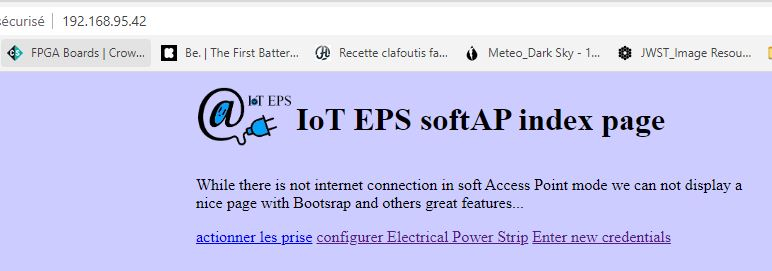
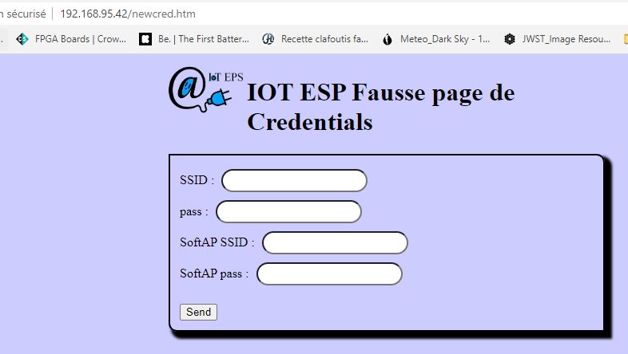

++++++++++++++++++++++++++++++++
IoT_EPS User Manual
++++++++++++++++++++++++++++++++

.. include:: volabid.rst

:Date: Décembre 2019
:last update: 28/12/2022

.. toctree::
   :maxdepth: 2
   :caption: Contents
   :titlesonly:
   
   documentationWriting
   userManualAnex

================================
First connection
================================
When connecting the power Strip for the first time, user should connect a WiFi Device in AP mode and
search IoT_ESP_HHHH SSID (where HHHH is 4 hexadecimal digits) 
and connect to it with password : 123456789

User should change this password and configure ip and password for WIFI station mode and restart.

================================
WIFI connections
================================
**AP mode** : is always available and default SSID name is IoT_ESP_HHHH.

**Station mode** : is available after first configuration and credential settings. In this mode, 
human interface is mode responsive due to boostrap CDN usage.

In station mode, user can address all its iot plugs from its internet browser of its Mac, PC 
or Android device.

====================================================================================================
Set SSIDs
====================================================================================================
With Web interface in AP mode
----------------------------------------------------------------------------------------------------
- connect to the access point (see ip address on OLED screen)
- from AP mode main page, choose "Enter new credentials"

    AP Mode main page 

- set credentials and clic send

    AP mode new credentials page 

.. NOTE:: Empty field are not change in the plug's credential file
   :class: without-title

With serial debug interface
----------------------------------------------------------------------------------------------------
For Station mode credentials, use :

- <I _newSSID> write SSID in credentials WARNING
- <i _wifiPass> write password in credentials WARNING

commands

And for AP mode credentials, use :

- <L> _newSoftAP_SSID> write SoftAP SSID in credentials WARNING
- <l> _wifiPass> write soft AP password in credentials WARNING

================================
Boutons
================================
In manuel mode, short press switch on/off the plug

Long press : return to manuel mode

At power up (wall plug - not by main power switch):
 - red push button : switch to very simple mode (without web interface)
 - green push button : restaure json file.

All the time Special PB + a plugs PB indicates the mode off the plug

- 1 flash <=> manual
- 2 flashes <=> timer
- 3 flashes <=> cycle
- 4 flashes <=> week mode

================================
Advanced user
================================

.. index::
    single: Serial;  speed

Serial com speed : 115200 (dans debugSerialPort.h DEBUGSPEED)

File upload : use web interface (need to be connected to internet) PowerStip01/edit
If your plug's name is PowerStrip01 or 192.168.1.xx/edit (access with it's IP addresse)

File delete : use seial commande <d _filename>

FTP server dosen't work very well

In csysstat.cpp et csysstat.h files, variable _forceSystemStartOnFatalError allow to disable the
sabordage behavior.

Special html pages (removed)
----------------------------------------------------------------------------------------------------
due to a lack of memory this pages was removed.

.. code::

    /time

    /edit to see and edit files in the SPIFFS (SPI Flash File System) of the ESP8266

    /list (just list files in json form) same as <D> serial command
    
Restaure data directory
----------------------------------------------------------------------------------------------------
.. WARNING:: Don't foget to put watchdog in 4mn15s wait with <Z> command
   :class: without-title

=========================================
Obtaine IP addresse of the Power strip 
=========================================
Use serial connexion <a> command if possible or an IP scanner like `AngryIP scanner`_

.. _`AngryIP scanner` : https://angryip.org/

Or read on OLED screen.

=========
Weblinks
=========

.. target-notes::
