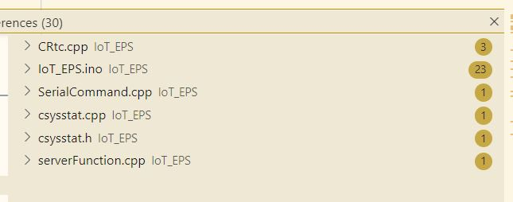
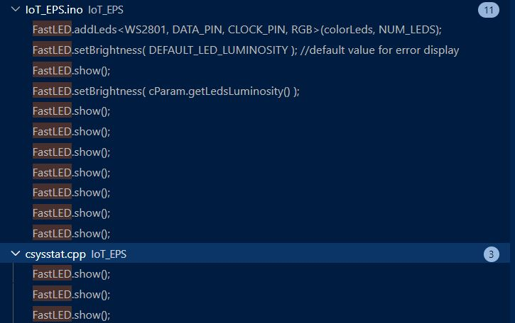
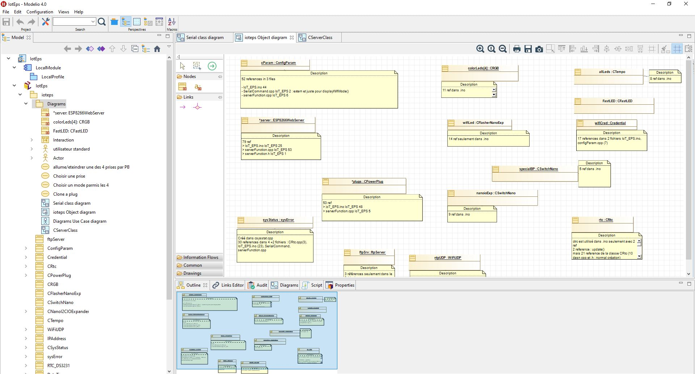

++++++++++++++++++++++++++++++++++++++++++++++++++++++++++++++++++++++++++++++++++++++++++++++++++++
Importants variables
++++++++++++++++++++++++++++++++++++++++++++++++++++++++++++++++++++++++++++++++++++++++++++++++++++

:Auteur: J.Soranzo
:Date: Juin 2020
:Societe: VoRoBoTics
:Entity: VoLAB

.. contents::
    :backlinks: top

====================================================================================================
Goal of this page
====================================================================================================
To try to have a global view of the software project.

.. _refVariableList:

====================================================================================================
List before OOnew more orientation refactoring in 2020 Jully
====================================================================================================
Global main variables:

- FtpServer 	ftpSrv :only 2 instances in .ino
- ConfigParam 	cParam  to hold the configuration parameters More...
- Credential 	wifiCred : 7 occurences
- CRtc 	rtc
- ESP8266WebServer * 	server
- CPowerPlug * 	plugs
- CRGB 	colorLeds [NUM_LEDS]
- bool 	simpleManualMode = false
- CFlasherNanoExp 	wifiLed
- int 	mainPowerSwitchState
- int 	mainPowerPrevState = 0
- CSwitchNano 	specialBp
- CNanoI2CIOExpander 	nanoioExp
- CTempo 	allLeds
- bool 	restartTempoLed = false
- WiFiUDP 	ntpUDP
- bool 	cycleState = false
- WiFi : global and auto-instanciation
- SPIFFS : global and auto-instanciation 
- watchdog : global and auto-instanciation 

Not directly listed in autogenerate doxygen documentation:

- dPrompt : is a macro not a variable
- sysStatus : global and auto-instanciation
- FastLED  : global and auto-instanciation

dprompt
====================================================================================================
dprompt is very useful to display message prompt in debug serial monitor.
It is declared in macro DEFDPROMPT(X) in debugSerialPort.h file

It is a local variable in the bloc where DEFDPROMTP is used

sysStatus
====================================================================================================
Auto declared global Instance of the CSysStatus classe in csysstat.cpp file

Its usage:

As this instance is declared in its own cpp file, it doesn't appear in the doxygen documentation.

This class stores system status and managed them.

28 references in 5 files

cParam
====================================================================================================
52 references in 3 files

- loT_EPS.ino 44
- SerialCommand.cpp loT_EPS 2
- serverFunction.cpp loT_EPS 6

This instance hold all configuration parameters

FastLED
====================================================================================================

11 occurrences in .ino file. 8 of .show method calls  and 3 .show() calls in cSysStat all in
err() method to display error

This class and moreover this `library from Daniel Garcia`_ manage the 4 color LEDs strip and
colorLeds array holds 4 CRGB objets to represent the LEDs. This arrays is passed to FastLEd object
as an argument.

FastLED is an auto-created object directly in the library .cpp file.

In my project, it is used to display colors of the LEDs and error message by CSysStatus

.. _`library from Daniel Garcia` : http://fastled.io/

Where colorLeds are initialised ? line 279: after  if ( !mainPowerSwitchState )

====================================================================================================
OO rewritting progress (last update 15/09/2020)
====================================================================================================
- CServerWeb written to hold all web server features ok
- CWifiLink just to hold wifi initialisation : 1%

====================================================================================================
After OOnew orientation
====================================================================================================

CSystem class
====================================================================================================
sysIoteps of **CSystem** class. This class should surround all system servitudes.

It should be possible and/or necessary to hold in this class the following features:

- FtpServer ftpSrv;
- CSystem sysIoteps;
- CServerWeb webServeur;
- CRtc rtc;
- void wifiLedFlash( int speed, int count ); //defined at the end of the present file
- ConfigParam cParam;
- Credential wifiCred;
- CPowerPlug \*plugs;
- CRGB colorLeds[NUM_LEDS];
- bool simpleManualMode = false;
- CFlasherNanoExp wifiLed;
- int mainPowerSwitchState;
- int mainPowerPrevState = 0;
- CSwitchNano specialBp;
- CNanoI2CIOExpander nanoioExp; //just for main pow led
- CTempo allLeds;
- bool restartTempoLed = false;
- WiFiUDP ntpUDP;

It is a deal between effort and improvement result the improvement doesn't reside in the variables
only but in the piece of code that it can simplify

CRtc and its usage
====================================================================================================
it is used by::

   into .ino file rtc global instance
      only for webServer init
            2 usages
               CServerWeb::displayTime()
               CServerWeb::handleIOTESPConfiguration()
      no begin and it works !!
   ino loop() rtc new instance in the loop
      pas de begin et ça marche
   CSystem class a _rtc member
      should be a pointer on the global variable => used on 5 lignes only

After OO refactoring, it is CSystem that initialize rtc instance.

FastLed and colorLeds case
====================================================================================================
2 different usages:

- to display plugs colors each plug holds its own color in its _couleur attirbut
- to display error alertes

So there is no reason for FastLed and colorLeds to be managed as a member of the CPowerPlug class.

====================================================================================================
A try to UML doc
====================================================================================================
I try to use Model Io to document this project

After some short test I leave it rappidly because of its internal structure.

It use a workspace behavior and a directory strucutred database.

Not very usefull for me becase i am aulone for this developpement and because it needs a hudge effort.

====================================================================================================
Graphiz experiment
====================================================================================================
3/7/2021

`Graphiz official web site`_

.. _`Graphiz official web site` : https://graphviz.org/

====================================================================================================
Weblinks
====================================================================================================

.. target-notes::